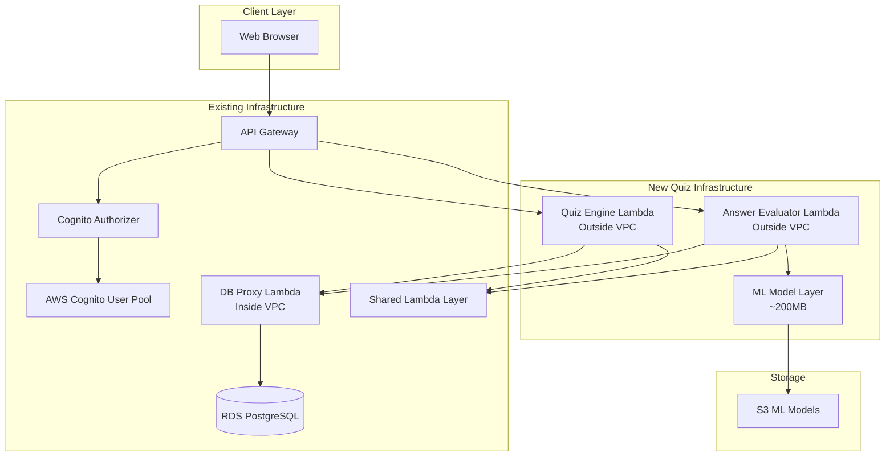

# Design Document: Quiz Engine and Answer Evaluation Deployment

## Deployment Architecture Reference

**IMPORTANT:** For complete deployment architecture documentation, see [`../../../infrastructure/README.md`](../../../infrastructure/README.md)

This project uses an iterative deployment approach:
- **Active deployment:** `infrastructure/app_auth_only.py` → `infrastructure/stacks/auth_only_stack.py`
- **Deploy command:** `cd infrastructure && cdk deploy`
- The Answer Evaluator Lambda is deployed as a container-based function with the ML model baked in

## Overview

This document specifies the design for deploying the Quiz Engine and Answer Evaluation system to AWS. The deployment extends the existing Know-It-All Tutor system architecture by adding quiz session management and ML-based answer evaluation capabilities while maintaining the serverless-first, domain-agnostic design principles.

**Key Design Principles:**
- Serverless-first architecture for scalability and cost efficiency
- Reuse existing infrastructure (VPC, RDS, Cognito, API Gateway)
- Lambda Bridge Pattern for VPC database access
- ML model deployment via Lambda layers
- Incremental deployment strategy with rollback capability
- AWS Free Tier optimization

## Architecture Overview

### High-Level Deployment Architecture




### Lambda Bridge Pattern

The deployment follows the Lambda Bridge Pattern where Lambda functions outside the VPC invoke a DB Proxy Lambda inside the VPC for all database operations:

```typescript
// Quiz Engine (Outside VPC) -> DB Proxy (Inside VPC) -> RDS PostgreSQL
interface LambdaBridgePattern {
  quizEngine: {
    location: 'Outside VPC'
    purpose: 'Quiz session management and business logic'
    databaseAccess: 'Via DB Proxy Lambda invocation'
    memory: '256MB'
    timeout: '30 seconds'
  }
  
  answerEvaluator: {
    location: 'Outside VPC'
    purpose: 'ML-based answer evaluation'
    databaseAccess: 'Via DB Proxy Lambda invocation'
    memory: '512MB'
    timeout: '60 seconds'
  }
  
  dbProxy: {
    location: 'Inside VPC'
    purpose: 'Database connection pooling and query execution'
    databaseAccess: 'Direct RDS connection'
    memory: '256MB'
    timeout: '30 seconds'
  }
}
```

**Benefits:**
- Quiz Engine and Answer Evaluator avoid VPC cold start penalties
- DB Proxy manages connection pooling efficiently
- Reduced NAT Gateway costs (no NAT Gateway needed)
- Simplified security model with single VPC entry point
- Reuses existing DB Proxy infrastructure


## Core Components

### 1. Quiz Engine Lambda Function

**Responsibility**: Quiz session management, question presentation, and session state tracking

**Configuration**:
```typescript
interface QuizEngineLambdaConfig {
  functionName: 'tutor-quiz-engine'
  runtime: 'python3.12'
  handler: 'quiz_engine/handler.main'
  memorySize: 256  // MB
  timeout: 30      // seconds
  location: 'Outside VPC'
  
  environment: {
    DB_PROXY_FUNCTION_NAME: 'tutor-db-proxy'
    LOG_LEVEL: 'INFO'
    REGION: 'us-east-1'
  }
  
  layers: [
    'shared-utilities-layer'  // Common database utilities
  ]
  
  iamPermissions: [
    'lambda:InvokeFunction (DB Proxy)',
    'logs:CreateLogGroup',
    'logs:CreateLogStream',
    'logs:PutLogEvents'
  ]
}
```

**Interface**:
```python
from typing import Dict, Optional, List
from dataclasses import dataclass
from enum import Enum

class QuizSessionStatus(Enum):
    ACTIVE = "active"
    PAUSED = "paused"
    COMPLETED = "completed"

@dataclass
class QuizSession:
    session_id: str
    user_id: str
    domain_id: str
    status: QuizSessionStatus
    current_term_index: int
    total_terms: int
    started_at: str
    paused_at: Optional[str] = None
    completed_at: Optional[str] = None

class QuizEngine:
    def start_quiz(self, user_id: str, domain_id: str) -> QuizSession:
        """
        Start a new quiz session for a user on a specific domain.
        
        Process:
        1. Validate user has access to domain
        2. Fetch all terms for the domain via DB Proxy
        3. Create quiz session record
        4. Return session with first question
        """
        pass
    
    def get_next_question(self, session_id: str) -> Optional[Dict]:
        """
        Get the next question in the quiz session.
        
        Returns:
        {
            "term_id": "uuid",
            "term": "Lambda",
            "question_number": 7,
            "total_questions": 23
        }
        """
        pass
    
    def submit_answer(
        self, 
        session_id: str, 
        term_id: str, 
        student_answer: str
    ) -> Dict:
        """
        Submit an answer and get evaluation result.
        
        Process:
        1. Validate session is active
        2. Fetch correct definition via DB Proxy
        3. Invoke Answer Evaluator Lambda
        4. Record progress via DB Proxy
        5. Update session state
        6. Return evaluation result
        """
        pass
    
    def pause_quiz(self, session_id: str) -> None:
        """Pause an active quiz session."""
        pass
    
    def resume_quiz(self, session_id: str) -> QuizSession:
        """Resume a paused quiz session."""
        pass
    
    def get_session(self, session_id: str) -> QuizSession:
        """Get quiz session details."""
        pass
    
    def delete_session(self, session_id: str) -> None:
        """Delete a quiz session."""
        pass
```


### 2. Answer Evaluator Lambda Function

**Responsibility**: ML-based semantic answer evaluation using sentence transformer model

**Configuration**:
```typescript
interface AnswerEvaluatorLambdaConfig {
  functionName: 'tutor-answer-evaluator'
  runtime: 'python3.12'
  handler: 'answer_evaluator/handler.main'
  memorySize: 512  // MB (required for ML model)
  timeout: 60      // seconds
  location: 'Outside VPC'
  
  environment: {
    MODEL_PATH: '/opt/ml_model'
    SIMILARITY_THRESHOLD: '0.7'
    DB_PROXY_FUNCTION_NAME: 'tutor-db-proxy'
    LOG_LEVEL: 'INFO'
  }
  
  layers: [
    'shared-utilities-layer',
    'ml-model-layer'  // ~200MB sentence transformer model
  ]
  
  iamPermissions: [
    'lambda:InvokeFunction (DB Proxy)',
    'logs:CreateLogGroup',
    'logs:CreateLogStream',
    'logs:PutLogEvents'
  ]
}
```

**Interface**:
```python
from typing import Dict, List, Tuple
from dataclasses import dataclass

@dataclass
class EvaluationResult:
    is_correct: bool
    similarity_score: float  # 0.0 to 1.0
    feedback: str
    correct_definition: str
    threshold: float

class AnswerEvaluator:
    def __init__(self, model_path: str = "/opt/ml_model"):
        """
        Initialize the answer evaluator with ML model.
        Model is loaded once per Lambda container and cached.
        """
        self.model = self._load_model(model_path)
        self.threshold = float(os.getenv('SIMILARITY_THRESHOLD', '0.7'))
    
    def evaluate_answer(
        self, 
        student_answer: str, 
        correct_answer: str,
        threshold: Optional[float] = None
    ) -> EvaluationResult:
        """
        Evaluate a student answer using semantic similarity.
        
        Process:
        1. Encode student answer to 768-dim vector
        2. Encode correct answer to 768-dim vector
        3. Calculate cosine similarity
        4. Compare against threshold
        5. Generate feedback based on score
        
        Returns:
        EvaluationResult with similarity score and feedback
        """
        pass
    
    def batch_evaluate(
        self, 
        answer_pairs: List[Tuple[str, str]],
        threshold: Optional[float] = None
    ) -> List[EvaluationResult]:
        """
        Batch evaluate multiple answers for efficiency.
        Useful for quiz completion summaries.
        """
        pass
    
    def health_check(self) -> Dict:
        """
        Verify ML model is loaded and functional.
        
        Returns:
        {
            "status": "healthy",
            "model_loaded": true,
            "model_path": "/opt/ml_model",
            "threshold": 0.7
        }
        """
        pass
    
    def _generate_feedback(self, score: float, threshold: float) -> str:
        """
        Generate graduated feedback based on similarity score.
        
        Score ranges:
        - >= threshold: "Excellent! Your answer demonstrates clear understanding."
        - 0.6-threshold: "Good attempt. Your answer is partially correct."
        - < 0.6: "Not quite. Review the correct definition."
        """
        pass
```


### 3. ML Model Lambda Layer

**Responsibility**: Package and distribute sentence transformer model for answer evaluation

**Configuration**:
```typescript
interface MLModelLayerConfig {
  layerName: 'tutor-ml-model-layer'
  description: 'Sentence transformer model for semantic answer evaluation'
  compatibleRuntimes: ['python3.12']
  
  structure: {
    '/opt/ml_model/': 'Model files (config.json, pytorch_model.bin, etc.)'
    '/opt/python/': 'Python dependencies (sentence-transformers, torch, etc.)'
  }
  
  size: '~200MB'
  
  dependencies: [
    'sentence-transformers==2.2.2',
    'torch==2.0.1',
    'transformers==4.30.2',
    'scikit-learn==1.3.0',
    'numpy==1.24.3'
  ]
  
  buildProcess: {
    source: './final_similarity_model/',
    target: '/opt/ml_model/',
    packaging: 'S3 (size > 50MB)',
    versioning: 'Enabled for rollback'
  }
}
```

**Layer Structure**:
```
ml-model-layer.zip
├── ml_model/
│   ├── config.json
│   ├── pytorch_model.bin
│   ├── tokenizer_config.json
│   ├── vocab.txt
│   └── special_tokens_map.json
└── python/
    ├── sentence_transformers/
    ├── torch/
    ├── transformers/
    ├── sklearn/
    └── numpy/
```

**Build Script**:
```bash
#!/bin/bash
# build_ml_layer.sh

# Create layer directory structure
mkdir -p layer/ml_model
mkdir -p layer/python

# Copy model files
cp -r final_similarity_model/* layer/ml_model/

# Install Python dependencies
pip install \
  sentence-transformers==2.2.2 \
  torch==2.0.1 \
  transformers==4.30.2 \
  scikit-learn==1.3.0 \
  numpy==1.24.3 \
  -t layer/python

# Create zip file
cd layer
zip -r ../ml-model-layer.zip .
cd ..

# Upload to S3 (required for layers > 50MB)
aws s3 cp ml-model-layer.zip s3://tutor-system-layers/ml-model-layer.zip

# Publish layer version
aws lambda publish-layer-version \
  --layer-name tutor-ml-model-layer \
  --description "Sentence transformer model v1.0" \
  --content S3Bucket=tutor-system-layers,S3Key=ml-model-layer.zip \
  --compatible-runtimes python3.12
```


### 4. DB Proxy Integration

**Existing Component**: The DB Proxy Lambda already exists in the tutor system architecture. The quiz deployment extends its functionality to support quiz operations.

**Extended Interface**:
```python
class DBProxy:
    """
    Existing DB Proxy with extended quiz operations.
    Located inside VPC with direct RDS access.
    """
    
    # Existing methods (already implemented)
    def create_user(self, user_data: Dict) -> str: pass
    def get_user(self, user_id: str) -> Dict: pass
    def create_domain(self, domain_data: Dict) -> str: pass
    def get_domains(self, user_id: str) -> List[Dict]: pass
    
    # New quiz-specific methods
    def create_quiz_session(self, session_data: Dict) -> str:
        """
        Create a new quiz session record.
        
        SQL:
        INSERT INTO quiz_sessions (user_id, domain_id, status, current_term_index)
        VALUES ($1, $2, $3, $4) RETURNING id
        """
        pass
    
    def get_quiz_session(self, session_id: str) -> Dict:
        """
        Retrieve quiz session details.
        
        SQL:
        SELECT * FROM quiz_sessions WHERE id = $1
        """
        pass
    
    def update_quiz_session(self, session_id: str, updates: Dict) -> None:
        """
        Update quiz session state (status, current_term_index, etc.).
        
        SQL:
        UPDATE quiz_sessions 
        SET status = $1, current_term_index = $2, updated_at = NOW()
        WHERE id = $3
        """
        pass
    
    def delete_quiz_session(self, session_id: str) -> None:
        """
        Delete a quiz session.
        
        SQL:
        DELETE FROM quiz_sessions WHERE id = $1
        """
        pass
    
    def get_domain_terms(self, domain_id: str) -> List[Dict]:
        """
        Fetch all terms for a domain.
        
        SQL:
        SELECT id, data->>'term' as term, data->>'definition' as definition
        FROM tree_nodes
        WHERE parent_id = $1 AND node_type = 'term'
        ORDER BY created_at
        """
        pass
    
    def record_progress(self, progress_data: Dict) -> str:
        """
        Record a student's answer attempt.
        
        SQL:
        INSERT INTO progress_records 
        (user_id, term_id, session_id, student_answer, correct_answer, 
         is_correct, similarity_score, attempt_number)
        VALUES ($1, $2, $3, $4, $5, $6, $7, $8)
        RETURNING id
        """
        pass
    
    def get_user_progress(self, user_id: str, domain_id: str) -> List[Dict]:
        """
        Get progress records for a user in a domain.
        
        SQL:
        SELECT pr.*, tn.data->>'term' as term
        FROM progress_records pr
        JOIN tree_nodes tn ON pr.term_id = tn.id
        WHERE pr.user_id = $1 AND tn.parent_id = $2
        ORDER BY pr.created_at DESC
        """
        pass
```


## API Gateway Integration

### Quiz Operations Endpoints

The deployment adds new routes to the existing API Gateway under the `/quiz` resource:

```typescript
interface QuizAPIRoutes {
  baseResource: '/quiz'
  authorizer: 'CognitoUserPoolAuthorizer'
  corsEnabled: true
  
  routes: [
    {
      path: '/quiz/start'
      method: 'POST'
      integration: 'Quiz Engine Lambda'
      authentication: 'Required'
      requestBody: {
        domain_id: 'string (required)'
      }
      responses: {
        200: 'QuizSession object'
        400: 'Invalid domain_id'
        401: 'Unauthorized'
        404: 'Domain not found'
      }
    },
    {
      path: '/quiz/question'
      method: 'GET'
      integration: 'Quiz Engine Lambda'
      authentication: 'Required'
      queryParameters: {
        session_id: 'string (required)'
      }
      responses: {
        200: 'Question object or null (quiz complete)'
        401: 'Unauthorized'
        404: 'Session not found'
      }
    },
    {
      path: '/quiz/answer'
      method: 'POST'
      integration: 'Quiz Engine Lambda'
      authentication: 'Required'
      requestBody: {
        session_id: 'string (required)'
        term_id: 'string (required)'
        answer: 'string (required)'
      }
      responses: {
        200: 'EvaluationResult object'
        400: 'Invalid request'
        401: 'Unauthorized'
        404: 'Session or term not found'
      }
    },
    {
      path: '/quiz/pause'
      method: 'POST'
      integration: 'Quiz Engine Lambda'
      authentication: 'Required'
      requestBody: {
        session_id: 'string (required)'
      }
      responses: {
        200: 'Success message'
        401: 'Unauthorized'
        404: 'Session not found'
        409: 'Session not active'
      }
    },
    {
      path: '/quiz/resume'
      method: 'POST'
      integration: 'Quiz Engine Lambda'
      authentication: 'Required'
      requestBody: {
        session_id: 'string (required)'
      }
      responses: {
        200: 'QuizSession object'
        401: 'Unauthorized'
        404: 'Session not found'
        409: 'Session not paused'
      }
    },
    {
      path: '/quiz/session/{sessionId}'
      method: 'GET'
      integration: 'Quiz Engine Lambda'
      authentication: 'Required'
      pathParameters: {
        sessionId: 'string (required)'
      }
      responses: {
        200: 'QuizSession object'
        401: 'Unauthorized'
        403: 'Access denied'
        404: 'Session not found'
      }
    },
    {
      path: '/quiz/session/{sessionId}'
      method: 'DELETE'
      integration: 'Quiz Engine Lambda'
      authentication: 'Required'
      pathParameters: {
        sessionId: 'string (required)'
      }
      responses: {
        204: 'Session deleted'
        401: 'Unauthorized'
        403: 'Access denied'
        404: 'Session not found'
      }
    }
  ]
}
```


### Answer Evaluation Endpoints

```typescript
interface EvaluationAPIRoutes {
  baseResource: '/quiz/evaluate'
  
  routes: [
    {
      path: '/quiz/evaluate'
      method: 'POST'
      integration: 'Answer Evaluator Lambda'
      authentication: 'Required'
      requestBody: {
        student_answer: 'string (required)'
        correct_answer: 'string (required)'
        threshold: 'number (optional, default: 0.7)'
      }
      responses: {
        200: 'EvaluationResult object'
        400: 'Invalid request'
        401: 'Unauthorized'
        503: 'ML model unavailable'
      }
    },
    {
      path: '/quiz/evaluate/batch'
      method: 'POST'
      integration: 'Answer Evaluator Lambda'
      authentication: 'Required'
      requestBody: {
        answer_pairs: 'Array<[string, string]> (required)'
        threshold: 'number (optional, default: 0.7)'
      }
      responses: {
        200: 'Array<EvaluationResult>'
        400: 'Invalid request'
        401: 'Unauthorized'
        503: 'ML model unavailable'
      }
    },
    {
      path: '/quiz/evaluate/health'
      method: 'GET'
      integration: 'Answer Evaluator Lambda'
      authentication: 'Not required'
      responses: {
        200: 'Health status object'
        503: 'Service unhealthy'
      }
    }
  ]
}
```

### CDK Stack Implementation

```python
# infrastructure/stacks/auth_only_stack.py (extended)

from aws_cdk import (
    Stack,
    aws_lambda as lambda_,
    aws_apigateway as apigw,
    aws_iam as iam,
    Duration,
    Size
)

class AuthOnlyStack(Stack):
    def __init__(self, scope, construct_id, **kwargs):
        super().__init__(scope, construct_id, **kwargs)
        
        # Existing resources (already deployed)
        self.cognito_user_pool = self._get_existing_cognito_pool()
        self.api_gateway = self._get_existing_api_gateway()
        self.cognito_authorizer = self._get_existing_authorizer()
        self.db_proxy_lambda = self._get_existing_db_proxy()
        self.shared_layer = self._get_existing_shared_layer()
        
        # New: ML Model Layer
        self.ml_model_layer = self._create_ml_model_layer()
        
        # New: Quiz Engine Lambda
        self.quiz_engine = self._create_quiz_engine_lambda()
        
        # New: Answer Evaluator Lambda
        self.answer_evaluator = self._create_answer_evaluator_lambda()
        
        # New: API Gateway Routes
        self._create_quiz_api_routes()
        self._create_evaluation_api_routes()
    
    def _create_ml_model_layer(self):
        """Create Lambda layer with ML model."""
        return lambda_.LayerVersion(
            self, 'MLModelLayer',
            layer_version_name='tutor-ml-model-layer',
            code=lambda_.Code.from_asset('./final_similarity_model'),
            compatible_runtimes=[lambda_.Runtime.PYTHON_3_12],
            description='Sentence transformer model for answer evaluation'
        )
    
    def _create_quiz_engine_lambda(self):
        """Create Quiz Engine Lambda function."""
        quiz_engine = lambda_.Function(
            self, 'QuizEngine',
            function_name='tutor-quiz-engine',
            runtime=lambda_.Runtime.PYTHON_3_12,
            handler='quiz_engine.handler.main',
            code=lambda_.Code.from_asset('./src/lambda_functions/quiz_engine'),
            memory_size=256,
            timeout=Duration.seconds(30),
            layers=[self.shared_layer],
            environment={
                'DB_PROXY_FUNCTION_NAME': self.db_proxy_lambda.function_name,
                'LOG_LEVEL': 'INFO',
                'REGION': self.region
            }
        )
        
        # Grant permission to invoke DB Proxy
        self.db_proxy_lambda.grant_invoke(quiz_engine)
        
        return quiz_engine
    
    def _create_answer_evaluator_lambda(self):
        """Create Answer Evaluator Lambda function."""
        answer_evaluator = lambda_.Function(
            self, 'AnswerEvaluator',
            function_name='tutor-answer-evaluator',
            runtime=lambda_.Runtime.PYTHON_3_12,
            handler='answer_evaluator.handler.main',
            code=lambda_.Code.from_asset('./src/lambda_functions/answer_evaluator'),
            memory_size=512,
            timeout=Duration.seconds(60),
            layers=[self.shared_layer, self.ml_model_layer],
            environment={
                'MODEL_PATH': '/opt/ml_model',
                'SIMILARITY_THRESHOLD': '0.7',
                'DB_PROXY_FUNCTION_NAME': self.db_proxy_lambda.function_name,
                'LOG_LEVEL': 'INFO'
            }
        )
        
        # Grant permission to invoke DB Proxy
        self.db_proxy_lambda.grant_invoke(answer_evaluator)
        
        return answer_evaluator
    
    def _create_quiz_api_routes(self):
        """Create API Gateway routes for quiz operations."""
        quiz_resource = self.api_gateway.root.add_resource('quiz')
        
        # POST /quiz/start
        start_resource = quiz_resource.add_resource('start')
        start_resource.add_method(
            'POST',
            apigw.LambdaIntegration(self.quiz_engine),
            authorizer=self.cognito_authorizer,
            authorization_type=apigw.AuthorizationType.COGNITO
        )
        
        # GET /quiz/question
        question_resource = quiz_resource.add_resource('question')
        question_resource.add_method(
            'GET',
            apigw.LambdaIntegration(self.quiz_engine),
            authorizer=self.cognito_authorizer,
            authorization_type=apigw.AuthorizationType.COGNITO
        )
        
        # POST /quiz/answer
        answer_resource = quiz_resource.add_resource('answer')
        answer_resource.add_method(
            'POST',
            apigw.LambdaIntegration(self.quiz_engine),
            authorizer=self.cognito_authorizer,
            authorization_type=apigw.AuthorizationType.COGNITO
        )
        
        # POST /quiz/pause
        pause_resource = quiz_resource.add_resource('pause')
        pause_resource.add_method(
            'POST',
            apigw.LambdaIntegration(self.quiz_engine),
            authorizer=self.cognito_authorizer,
            authorization_type=apigw.AuthorizationType.COGNITO
        )
        
        # POST /quiz/resume
        resume_resource = quiz_resource.add_resource('resume')
        resume_resource.add_method(
            'POST',
            apigw.LambdaIntegration(self.quiz_engine),
            authorizer=self.cognito_authorizer,
            authorization_type=apigw.AuthorizationType.COGNITO
        )
        
        # GET/DELETE /quiz/session/{sessionId}
        session_resource = quiz_resource.add_resource('session')
        session_id_resource = session_resource.add_resource('{sessionId}')
        session_id_resource.add_method(
            'GET',
            apigw.LambdaIntegration(self.quiz_engine),
            authorizer=self.cognito_authorizer,
            authorization_type=apigw.AuthorizationType.COGNITO
        )
        session_id_resource.add_method(
            'DELETE',
            apigw.LambdaIntegration(self.quiz_engine),
            authorizer=self.cognito_authorizer,
            authorization_type=apigw.AuthorizationType.COGNITO
        )
        
        # Enable CORS for all quiz routes
        self._enable_cors(quiz_resource)
    
    def _create_evaluation_api_routes(self):
        """Create API Gateway routes for answer evaluation."""
        evaluate_resource = self.api_gateway.root.resource_for_path('/quiz').add_resource('evaluate')
        
        # POST /quiz/evaluate
        evaluate_resource.add_method(
            'POST',
            apigw.LambdaIntegration(self.answer_evaluator),
            authorizer=self.cognito_authorizer,
            authorization_type=apigw.AuthorizationType.COGNITO
        )
        
        # POST /quiz/evaluate/batch
        batch_resource = evaluate_resource.add_resource('batch')
        batch_resource.add_method(
            'POST',
            apigw.LambdaIntegration(self.answer_evaluator),
            authorizer=self.cognito_authorizer,
            authorization_type=apigw.AuthorizationType.COGNITO
        )
        
        # GET /quiz/evaluate/health (no auth required)
        health_resource = evaluate_resource.add_resource('health')
        health_resource.add_method(
            'GET',
            apigw.LambdaIntegration(self.answer_evaluator)
        )
        
        # Enable CORS
        self._enable_cors(evaluate_resource)
```


## Database Schema Extensions

The quiz deployment requires extending the existing RDS PostgreSQL schema with quiz-specific tables:

```sql
-- Quiz sessions table (already exists in tutor system)
-- Verify structure matches requirements
CREATE TABLE IF NOT EXISTS quiz_sessions (
  id UUID PRIMARY KEY DEFAULT uuid_generate_v4(),
  user_id UUID REFERENCES users(id) NOT NULL,
  domain_id UUID REFERENCES tree_nodes(id) NOT NULL,
  status VARCHAR(20) DEFAULT 'active' CHECK (status IN ('active', 'paused', 'completed')),
  current_term_index INTEGER DEFAULT 0,
  total_terms INTEGER NOT NULL,
  started_at TIMESTAMP DEFAULT CURRENT_TIMESTAMP,
  paused_at TIMESTAMP,
  completed_at TIMESTAMP,
  updated_at TIMESTAMP DEFAULT CURRENT_TIMESTAMP
);

-- Progress records table (already exists in tutor system)
-- Verify structure matches requirements
CREATE TABLE IF NOT EXISTS progress_records (
  id UUID PRIMARY KEY DEFAULT uuid_generate_v4(),
  user_id UUID REFERENCES users(id) NOT NULL,
  term_id UUID REFERENCES tree_nodes(id) NOT NULL,
  session_id UUID REFERENCES quiz_sessions(id),
  student_answer TEXT NOT NULL,
  correct_answer TEXT NOT NULL,
  is_correct BOOLEAN NOT NULL,
  similarity_score DECIMAL(3,2),
  attempt_number INTEGER DEFAULT 1,
  created_at TIMESTAMP DEFAULT CURRENT_TIMESTAMP
);

-- Indexes for performance
CREATE INDEX IF NOT EXISTS idx_quiz_sessions_user ON quiz_sessions(user_id);
CREATE INDEX IF NOT EXISTS idx_quiz_sessions_domain ON quiz_sessions(domain_id);
CREATE INDEX IF NOT EXISTS idx_quiz_sessions_status ON quiz_sessions(status);
CREATE INDEX IF NOT EXISTS idx_progress_user_term ON progress_records(user_id, term_id);
CREATE INDEX IF NOT EXISTS idx_progress_session ON progress_records(session_id);

-- Tree nodes table (already exists)
-- Verify indexes for quiz operations
CREATE INDEX IF NOT EXISTS idx_tree_nodes_parent ON tree_nodes(parent_id);
CREATE INDEX IF NOT EXISTS idx_tree_nodes_type ON tree_nodes(node_type);
CREATE INDEX IF NOT EXISTS idx_tree_nodes_user ON tree_nodes(user_id);
```

### Database Migration Strategy

```python
# scripts/migrate_quiz_schema.py

import psycopg2
from typing import List, Dict

class QuizSchemaMigration:
    """
    Database migration for quiz engine deployment.
    Validates existing schema and adds missing components.
    """
    
    def __init__(self, db_config: Dict):
        self.conn = psycopg2.connect(**db_config)
        self.cursor = self.conn.cursor()
    
    def validate_schema(self) -> Dict[str, bool]:
        """
        Validate that required tables and indexes exist.
        
        Returns:
        {
            "quiz_sessions_table": true,
            "progress_records_table": true,
            "tree_nodes_indexes": true,
            "quiz_sessions_indexes": true
        }
        """
        validation_results = {}
        
        # Check quiz_sessions table
        self.cursor.execute("""
            SELECT EXISTS (
                SELECT FROM information_schema.tables 
                WHERE table_name = 'quiz_sessions'
            )
        """)
        validation_results['quiz_sessions_table'] = self.cursor.fetchone()[0]
        
        # Check progress_records table
        self.cursor.execute("""
            SELECT EXISTS (
                SELECT FROM information_schema.tables 
                WHERE table_name = 'progress_records'
            )
        """)
        validation_results['progress_records_table'] = self.cursor.fetchone()[0]
        
        # Check tree_nodes indexes
        required_indexes = [
            'idx_tree_nodes_parent',
            'idx_tree_nodes_type',
            'idx_tree_nodes_user'
        ]
        for index_name in required_indexes:
            self.cursor.execute("""
                SELECT EXISTS (
                    SELECT FROM pg_indexes 
                    WHERE indexname = %s
                )
            """, (index_name,))
            validation_results[index_name] = self.cursor.fetchone()[0]
        
        return validation_results
    
    def apply_migration(self) -> None:
        """
        Apply quiz schema migration.
        Creates missing tables and indexes.
        """
        try:
            # Create quiz_sessions table if missing
            self.cursor.execute("""
                CREATE TABLE IF NOT EXISTS quiz_sessions (
                    id UUID PRIMARY KEY DEFAULT uuid_generate_v4(),
                    user_id UUID REFERENCES users(id) NOT NULL,
                    domain_id UUID REFERENCES tree_nodes(id) NOT NULL,
                    status VARCHAR(20) DEFAULT 'active' 
                        CHECK (status IN ('active', 'paused', 'completed')),
                    current_term_index INTEGER DEFAULT 0,
                    total_terms INTEGER NOT NULL,
                    started_at TIMESTAMP DEFAULT CURRENT_TIMESTAMP,
                    paused_at TIMESTAMP,
                    completed_at TIMESTAMP,
                    updated_at TIMESTAMP DEFAULT CURRENT_TIMESTAMP
                )
            """)
            
            # Create progress_records table if missing
            self.cursor.execute("""
                CREATE TABLE IF NOT EXISTS progress_records (
                    id UUID PRIMARY KEY DEFAULT uuid_generate_v4(),
                    user_id UUID REFERENCES users(id) NOT NULL,
                    term_id UUID REFERENCES tree_nodes(id) NOT NULL,
                    session_id UUID REFERENCES quiz_sessions(id),
                    student_answer TEXT NOT NULL,
                    correct_answer TEXT NOT NULL,
                    is_correct BOOLEAN NOT NULL,
                    similarity_score DECIMAL(3,2),
                    attempt_number INTEGER DEFAULT 1,
                    created_at TIMESTAMP DEFAULT CURRENT_TIMESTAMP
                )
            """)
            
            # Create indexes
            indexes = [
                "CREATE INDEX IF NOT EXISTS idx_quiz_sessions_user ON quiz_sessions(user_id)",
                "CREATE INDEX IF NOT EXISTS idx_quiz_sessions_domain ON quiz_sessions(domain_id)",
                "CREATE INDEX IF NOT EXISTS idx_quiz_sessions_status ON quiz_sessions(status)",
                "CREATE INDEX IF NOT EXISTS idx_progress_user_term ON progress_records(user_id, term_id)",
                "CREATE INDEX IF NOT EXISTS idx_progress_session ON progress_records(session_id)",
                "CREATE INDEX IF NOT EXISTS idx_tree_nodes_parent ON tree_nodes(parent_id)",
                "CREATE INDEX IF NOT EXISTS idx_tree_nodes_type ON tree_nodes(node_type)",
                "CREATE INDEX IF NOT EXISTS idx_tree_nodes_user ON tree_nodes(user_id)"
            ]
            
            for index_sql in indexes:
                self.cursor.execute(index_sql)
            
            self.conn.commit()
            print("✓ Quiz schema migration completed successfully")
            
        except Exception as e:
            self.conn.rollback()
            print(f"✗ Migration failed: {str(e)}")
            raise
    
    def verify_db_proxy_permissions(self) -> bool:
        """
        Verify DB Proxy has permissions for quiz tables.
        """
        try:
            # Test SELECT permission on quiz_sessions
            self.cursor.execute("SELECT 1 FROM quiz_sessions LIMIT 1")
            
            # Test INSERT permission
            self.cursor.execute("""
                SELECT has_table_privilege('quiz_sessions', 'INSERT')
            """)
            
            return True
        except Exception as e:
            print(f"✗ DB Proxy permission check failed: {str(e)}")
            return False
```


## Deployment Strategy

### Incremental Deployment Phases

The deployment follows a phased approach to minimize risk and enable rollback:

```typescript
interface DeploymentPhases {
  phase1: {
    name: 'ML Model Layer Deployment'
    components: ['ML Model Layer']
    validation: [
      'Layer size < 250MB',
      'S3 upload successful',
      'Layer version published'
    ]
    rollback: 'Delete layer version'
  }
  
  phase2: {
    name: 'Database Schema Migration'
    components: ['quiz_sessions table', 'progress_records indexes']
    validation: [
      'Tables exist',
      'Indexes created',
      'DB Proxy permissions verified'
    ]
    rollback: 'Revert migration (if safe)'
  }
  
  phase3: {
    name: 'Answer Evaluator Deployment'
    components: ['Answer Evaluator Lambda']
    validation: [
      'Lambda created',
      'ML model loads successfully',
      'Health check passes'
    ]
    rollback: 'Delete Lambda function'
  }
  
  phase4: {
    name: 'Quiz Engine Deployment'
    components: ['Quiz Engine Lambda']
    validation: [
      'Lambda created',
      'DB Proxy invocation works',
      'Can create quiz session'
    ]
    rollback: 'Delete Lambda function'
  }
  
  phase5: {
    name: 'API Gateway Integration'
    components: ['Quiz routes', 'Evaluation routes']
    validation: [
      'Routes created',
      'Cognito authorizer attached',
      'CORS configured',
      'End-to-end test passes'
    ]
    rollback: 'Remove API routes'
  }
}
```

### Deployment Commands

```bash
# Phase 1: Build and deploy ML Model Layer
cd infrastructure
./scripts/build_ml_layer.sh
cdk deploy --require-approval never --outputs-file outputs.json

# Phase 2: Database migration
python3 scripts/migrate_quiz_schema.py --validate
python3 scripts/migrate_quiz_schema.py --apply

# Phase 3: Deploy Answer Evaluator
cdk deploy AuthOnlyStack --exclusively --require-approval never

# Phase 4: Deploy Quiz Engine
cdk deploy AuthOnlyStack --exclusively --require-approval never

# Phase 5: Deploy API Gateway routes
cdk deploy AuthOnlyStack --exclusively --require-approval never

# Validation
python3 scripts/test_quiz_deployment.py --full
```

### Rollback Strategy

```python
# scripts/rollback_quiz_deployment.py

class QuizDeploymentRollback:
    """
    Rollback quiz engine deployment to previous state.
    """
    
    def __init__(self, aws_session):
        self.lambda_client = aws_session.client('lambda')
        self.apigateway_client = aws_session.client('apigateway')
        self.rds_client = aws_session.client('rds')
    
    def rollback_lambda_functions(self) -> None:
        """
        Rollback Lambda functions to previous versions.
        """
        functions = ['tutor-quiz-engine', 'tutor-answer-evaluator']
        
        for function_name in functions:
            try:
                # Get previous version
                response = self.lambda_client.list_versions_by_function(
                    FunctionName=function_name
                )
                versions = response['Versions']
                
                if len(versions) >= 2:
                    previous_version = versions[-2]['Version']
                    
                    # Update alias to point to previous version
                    self.lambda_client.update_alias(
                        FunctionName=function_name,
                        Name='PROD',
                        FunctionVersion=previous_version
                    )
                    
                    print(f"✓ Rolled back {function_name} to version {previous_version}")
                else:
                    print(f"✗ No previous version found for {function_name}")
                    
            except Exception as e:
                print(f"✗ Rollback failed for {function_name}: {str(e)}")
    
    def rollback_api_gateway(self, api_id: str) -> None:
        """
        Rollback API Gateway to previous deployment.
        """
        try:
            # Get previous deployment
            response = self.apigateway_client.get_deployments(
                restApiId=api_id,
                limit=2
            )
            
            if len(response['items']) >= 2:
                previous_deployment = response['items'][1]['id']
                
                # Update stage to use previous deployment
                self.apigateway_client.update_stage(
                    restApiId=api_id,
                    stageName='prod',
                    patchOperations=[
                        {
                            'op': 'replace',
                            'path': '/deploymentId',
                            'value': previous_deployment
                        }
                    ]
                )
                
                print(f"✓ Rolled back API Gateway to deployment {previous_deployment}")
            else:
                print("✗ No previous API Gateway deployment found")
                
        except Exception as e:
            print(f"✗ API Gateway rollback failed: {str(e)}")
    
    def rollback_database_migration(self) -> None:
        """
        Rollback database migration (if safe).
        
        WARNING: Only rolls back schema changes, not data.
        Data in quiz_sessions and progress_records is preserved.
        """
        print("⚠ Database rollback preserves existing data")
        print("⚠ Only schema changes (indexes) will be reverted")
        
        # This is intentionally conservative - we don't drop tables
        # that may contain user data
        pass
```


## Testing Strategy

### Integration Testing

```python
# scripts/test_quiz_deployment.py

import boto3
import requests
from typing import Dict, List

class QuizDeploymentTests:
    """
    Integration tests for quiz engine deployment.
    """
    
    def __init__(self, api_base_url: str, cognito_config: Dict):
        self.api_base_url = api_base_url
        self.cognito_config = cognito_config
        self.access_token = None
    
    def authenticate(self) -> str:
        """
        Authenticate with Cognito and get access token.
        """
        cognito_client = boto3.client('cognito-idp')
        
        response = cognito_client.initiate_auth(
            ClientId=self.cognito_config['client_id'],
            AuthFlow='USER_PASSWORD_AUTH',
            AuthParameters={
                'USERNAME': self.cognito_config['test_username'],
                'PASSWORD': self.cognito_config['test_password']
            }
        )
        
        self.access_token = response['AuthenticationResult']['AccessToken']
        return self.access_token
    
    def test_start_quiz(self, domain_id: str) -> Dict:
        """
        Test: Start a quiz session.
        Validates: Requirement 1.1-1.7
        """
        response = requests.post(
            f"{self.api_base_url}/quiz/start",
            headers={'Authorization': f'Bearer {self.access_token}'},
            json={'domain_id': domain_id}
        )
        
        assert response.status_code == 200, f"Expected 200, got {response.status_code}"
        
        session = response.json()
        assert 'session_id' in session
        assert session['status'] == 'active'
        assert session['current_term_index'] == 0
        
        print("✓ Test passed: Start quiz session")
        return session
    
    def test_get_question(self, session_id: str) -> Dict:
        """
        Test: Get next question in quiz.
        Validates: Requirement 4.4
        """
        response = requests.get(
            f"{self.api_base_url}/quiz/question",
            headers={'Authorization': f'Bearer {self.access_token}'},
            params={'session_id': session_id}
        )
        
        assert response.status_code == 200
        
        question = response.json()
        assert 'term_id' in question
        assert 'term' in question
        assert 'question_number' in question
        
        print("✓ Test passed: Get quiz question")
        return question
    
    def test_submit_answer(self, session_id: str, term_id: str, answer: str) -> Dict:
        """
        Test: Submit answer and get evaluation.
        Validates: Requirements 2.1-2.7, 7.3
        """
        response = requests.post(
            f"{self.api_base_url}/quiz/answer",
            headers={'Authorization': f'Bearer {self.access_token}'},
            json={
                'session_id': session_id,
                'term_id': term_id,
                'answer': answer
            }
        )
        
        assert response.status_code == 200
        
        result = response.json()
        assert 'is_correct' in result
        assert 'similarity_score' in result
        assert 'feedback' in result
        assert 0.0 <= result['similarity_score'] <= 1.0
        
        print(f"✓ Test passed: Submit answer (score: {result['similarity_score']})")
        return result
    
    def test_pause_resume_quiz(self, session_id: str) -> None:
        """
        Test: Pause and resume quiz session.
        Validates: Requirements 4.5, 4.6
        """
        # Pause quiz
        response = requests.post(
            f"{self.api_base_url}/quiz/pause",
            headers={'Authorization': f'Bearer {self.access_token}'},
            json={'session_id': session_id}
        )
        
        assert response.status_code == 200
        
        # Verify session is paused
        response = requests.get(
            f"{self.api_base_url}/quiz/session/{session_id}",
            headers={'Authorization': f'Bearer {self.access_token}'}
        )
        
        session = response.json()
        assert session['status'] == 'paused'
        assert session['paused_at'] is not None
        
        # Resume quiz
        response = requests.post(
            f"{self.api_base_url}/quiz/resume",
            headers={'Authorization': f'Bearer {self.access_token}'},
            json={'session_id': session_id}
        )
        
        assert response.status_code == 200
        
        session = response.json()
        assert session['status'] == 'active'
        
        print("✓ Test passed: Pause and resume quiz")
    
    def test_answer_evaluator_health(self) -> None:
        """
        Test: Answer evaluator health check.
        Validates: Requirement 5.3
        """
        response = requests.get(
            f"{self.api_base_url}/quiz/evaluate/health"
        )
        
        assert response.status_code == 200
        
        health = response.json()
        assert health['status'] == 'healthy'
        assert health['model_loaded'] == True
        
        print("✓ Test passed: Answer evaluator health check")
    
    def test_semantic_evaluation(self) -> None:
        """
        Test: Semantic answer evaluation.
        Validates: Requirements 2.1-2.4
        """
        test_cases = [
            {
                'student_answer': 'A serverless compute service that runs code',
                'correct_answer': 'AWS Lambda is a serverless compute service',
                'expected_score_range': (0.7, 1.0)
            },
            {
                'student_answer': 'Something about computers',
                'correct_answer': 'AWS Lambda is a serverless compute service',
                'expected_score_range': (0.0, 0.5)
            }
        ]
        
        for test_case in test_cases:
            response = requests.post(
                f"{self.api_base_url}/quiz/evaluate",
                headers={'Authorization': f'Bearer {self.access_token}'},
                json={
                    'student_answer': test_case['student_answer'],
                    'correct_answer': test_case['correct_answer']
                }
            )
            
            assert response.status_code == 200
            
            result = response.json()
            score = result['similarity_score']
            min_score, max_score = test_case['expected_score_range']
            
            assert min_score <= score <= max_score, \
                f"Score {score} not in expected range [{min_score}, {max_score}]"
        
        print("✓ Test passed: Semantic evaluation")
    
    def test_db_proxy_integration(self) -> None:
        """
        Test: DB Proxy integration for quiz operations.
        Validates: Requirements 1.6, 2.6, 6.5
        """
        lambda_client = boto3.client('lambda')
        
        # Test DB Proxy can be invoked
        response = lambda_client.invoke(
            FunctionName='tutor-db-proxy',
            InvocationType='RequestResponse',
            Payload='{"operation": "health_check"}'
        )
        
        assert response['StatusCode'] == 200
        
        print("✓ Test passed: DB Proxy integration")
    
    def run_all_tests(self, domain_id: str) -> None:
        """
        Run complete test suite.
        """
        print("\n=== Quiz Engine Deployment Tests ===\n")
        
        # Authenticate
        print("Authenticating...")
        self.authenticate()
        
        # Test quiz workflow
        session = self.test_start_quiz(domain_id)
        question = self.test_get_question(session['session_id'])
        self.test_submit_answer(
            session['session_id'],
            question['term_id'],
            'Test answer for evaluation'
        )
        self.test_pause_resume_quiz(session['session_id'])
        
        # Test answer evaluator
        self.test_answer_evaluator_health()
        self.test_semantic_evaluation()
        
        # Test infrastructure
        self.test_db_proxy_integration()
        
        print("\n=== All tests passed ✓ ===\n")
```


### Property-Based Testing

```python
# tests/property_tests/test_quiz_properties.py

from hypothesis import given, strategies as st, settings
from hypothesis.stateful import RuleBasedStateMachine, rule, invariant
import pytest

class QuizSessionStateMachine(RuleBasedStateMachine):
    """
    Property-based testing for quiz session state management.
    Validates: Requirements 4.5, 4.6
    """
    
    def __init__(self):
        super().__init__()
        self.sessions = {}
        self.current_session = None
    
    @rule(domain_id=st.uuids(), user_id=st.uuids())
    def start_quiz(self, domain_id, user_id):
        """Property: Starting a quiz creates an active session."""
        session_id = str(uuid.uuid4())
        self.sessions[session_id] = {
            'status': 'active',
            'domain_id': domain_id,
            'user_id': user_id,
            'current_term_index': 0
        }
        self.current_session = session_id
    
    @rule()
    def pause_quiz(self):
        """Property: Pausing an active quiz changes status to paused."""
        if self.current_session and self.sessions[self.current_session]['status'] == 'active':
            self.sessions[self.current_session]['status'] = 'paused'
    
    @rule()
    def resume_quiz(self):
        """Property: Resuming a paused quiz changes status to active."""
        if self.current_session and self.sessions[self.current_session]['status'] == 'paused':
            self.sessions[self.current_session]['status'] = 'active'
    
    @invariant()
    def session_state_valid(self):
        """Property: Session status is always valid."""
        for session in self.sessions.values():
            assert session['status'] in ['active', 'paused', 'completed']
    
    @invariant()
    def term_index_non_negative(self):
        """Property: Current term index is never negative."""
        for session in self.sessions.values():
            assert session['current_term_index'] >= 0

@given(
    student_answer=st.text(min_size=1, max_size=500),
    correct_answer=st.text(min_size=1, max_size=500)
)
@settings(max_examples=100)
def test_evaluation_consistency(student_answer, correct_answer):
    """
    Property: Multiple evaluations of the same answer produce identical scores.
    Validates: Requirement 7.1
    """
    evaluator = AnswerEvaluator()
    
    # Evaluate twice
    result1 = evaluator.evaluate_answer(student_answer, correct_answer)
    result2 = evaluator.evaluate_answer(student_answer, correct_answer)
    
    # Scores must be identical
    assert result1.similarity_score == result2.similarity_score
    assert result1.is_correct == result2.is_correct

@given(
    answer=st.text(min_size=1, max_size=500),
    definition=st.text(min_size=1, max_size=500)
)
@settings(max_examples=100)
def test_evaluation_symmetry(answer, definition):
    """
    Property: Evaluation is symmetric - order doesn't matter for identical texts.
    Validates: Requirement 7.1
    """
    evaluator = AnswerEvaluator()
    
    # Evaluate in both directions
    result1 = evaluator.evaluate_answer(answer, definition)
    result2 = evaluator.evaluate_answer(definition, answer)
    
    # Scores should be identical (cosine similarity is symmetric)
    assert abs(result1.similarity_score - result2.similarity_score) < 0.01

@given(
    session_data=st.fixed_dictionaries({
        'user_id': st.uuids(),
        'domain_id': st.uuids(),
        'current_term_index': st.integers(min_value=0, max_value=100)
    })
)
@settings(max_examples=50)
def test_session_persistence_round_trip(session_data):
    """
    Property: Storing and retrieving session data preserves all fields.
    Validates: Requirement 5.1
    """
    # Create session
    session_id = create_quiz_session(session_data)
    
    # Retrieve session
    retrieved = get_quiz_session(session_id)
    
    # All fields must match
    assert str(retrieved['user_id']) == str(session_data['user_id'])
    assert str(retrieved['domain_id']) == str(session_data['domain_id'])
    assert retrieved['current_term_index'] == session_data['current_term_index']

@given(
    scores=st.lists(
        st.floats(min_value=0.0, max_value=1.0),
        min_size=1,
        max_size=50
    )
)
@settings(max_examples=100)
def test_progress_calculation_monotonicity(scores):
    """
    Property: Adding more attempts never decreases mastery level.
    Validates: Requirement 4.5
    """
    mastery_levels = []
    
    for i in range(len(scores)):
        # Calculate mastery with increasing number of attempts
        current_scores = scores[:i+1]
        mastery = calculate_mastery(current_scores)
        mastery_levels.append(mastery)
    
    # Mastery should be monotonically non-decreasing
    for i in range(len(mastery_levels) - 1):
        assert mastery_levels[i] <= mastery_levels[i+1]
```


## Monitoring and Logging

### CloudWatch Configuration

```python
# infrastructure/monitoring/quiz_monitoring.py

from aws_cdk import (
    aws_cloudwatch as cloudwatch,
    aws_cloudwatch_actions as cw_actions,
    aws_sns as sns,
    Duration
)

class QuizMonitoring:
    """
    CloudWatch monitoring and alerting for quiz engine.
    Validates: Requirements 10.1-10.6
    """
    
    def __init__(self, stack, quiz_engine, answer_evaluator):
        self.stack = stack
        self.quiz_engine = quiz_engine
        self.answer_evaluator = answer_evaluator
        
        # Create SNS topic for alerts
        self.alert_topic = sns.Topic(
            stack, 'QuizAlertTopic',
            display_name='Quiz Engine Alerts'
        )
        
        self._create_lambda_metrics()
        self._create_alarms()
        self._create_dashboard()
    
    def _create_lambda_metrics(self):
        """Create custom CloudWatch metrics."""
        
        # Quiz Engine metrics
        self.quiz_engine_invocations = cloudwatch.Metric(
            namespace='AWS/Lambda',
            metric_name='Invocations',
            dimensions_map={
                'FunctionName': self.quiz_engine.function_name
            },
            statistic='Sum',
            period=Duration.minutes(5)
        )
        
        self.quiz_engine_errors = cloudwatch.Metric(
            namespace='AWS/Lambda',
            metric_name='Errors',
            dimensions_map={
                'FunctionName': self.quiz_engine.function_name
            },
            statistic='Sum',
            period=Duration.minutes(5)
        )
        
        self.quiz_engine_duration = cloudwatch.Metric(
            namespace='AWS/Lambda',
            metric_name='Duration',
            dimensions_map={
                'FunctionName': self.quiz_engine.function_name
            },
            statistic='Average',
            period=Duration.minutes(5)
        )
        
        # Answer Evaluator metrics
        self.answer_eval_invocations = cloudwatch.Metric(
            namespace='AWS/Lambda',
            metric_name='Invocations',
            dimensions_map={
                'FunctionName': self.answer_evaluator.function_name
            },
            statistic='Sum',
            period=Duration.minutes(5)
        )
        
        self.answer_eval_duration = cloudwatch.Metric(
            namespace='AWS/Lambda',
            metric_name='Duration',
            dimensions_map={
                'FunctionName': self.answer_evaluator.function_name
            },
            statistic='Average',
            period=Duration.minutes(5)
        )
    
    def _create_alarms(self):
        """Create CloudWatch alarms."""
        
        # Quiz Engine error rate alarm
        quiz_error_alarm = cloudwatch.Alarm(
            self.stack, 'QuizEngineErrorAlarm',
            alarm_name='quiz-engine-high-error-rate',
            metric=self.quiz_engine_errors,
            threshold=5,
            evaluation_periods=2,
            comparison_operator=cloudwatch.ComparisonOperator.GREATER_THAN_THRESHOLD,
            alarm_description='Quiz Engine error rate exceeded threshold'
        )
        quiz_error_alarm.add_alarm_action(
            cw_actions.SnsAction(self.alert_topic)
        )
        
        # Quiz Engine duration alarm
        quiz_duration_alarm = cloudwatch.Alarm(
            self.stack, 'QuizEngineDurationAlarm',
            alarm_name='quiz-engine-high-duration',
            metric=self.quiz_engine_duration,
            threshold=25000,  # 25 seconds (83% of 30s timeout)
            evaluation_periods=3,
            comparison_operator=cloudwatch.ComparisonOperator.GREATER_THAN_THRESHOLD,
            alarm_description='Quiz Engine duration approaching timeout'
        )
        quiz_duration_alarm.add_alarm_action(
            cw_actions.SnsAction(self.alert_topic)
        )
        
        # Answer Evaluator error rate alarm
        eval_error_alarm = cloudwatch.Alarm(
            self.stack, 'AnswerEvalErrorAlarm',
            alarm_name='answer-evaluator-high-error-rate',
            metric=cloudwatch.Metric(
                namespace='AWS/Lambda',
                metric_name='Errors',
                dimensions_map={
                    'FunctionName': self.answer_evaluator.function_name
                },
                statistic='Sum',
                period=Duration.minutes(5)
            ),
            threshold=5,
            evaluation_periods=2,
            comparison_operator=cloudwatch.ComparisonOperator.GREATER_THAN_THRESHOLD,
            alarm_description='Answer Evaluator error rate exceeded threshold'
        )
        eval_error_alarm.add_alarm_action(
            cw_actions.SnsAction(self.alert_topic)
        )
        
        # Answer Evaluator duration alarm
        eval_duration_alarm = cloudwatch.Alarm(
            self.stack, 'AnswerEvalDurationAlarm',
            alarm_name='answer-evaluator-high-duration',
            metric=self.answer_eval_duration,
            threshold=50000,  # 50 seconds (83% of 60s timeout)
            evaluation_periods=3,
            comparison_operator=cloudwatch.ComparisonOperator.GREATER_THAN_THRESHOLD,
            alarm_description='Answer Evaluator duration approaching timeout'
        )
        eval_duration_alarm.add_alarm_action(
            cw_actions.SnsAction(self.alert_topic)
        )
    
    def _create_dashboard(self):
        """Create CloudWatch dashboard."""
        
        dashboard = cloudwatch.Dashboard(
            self.stack, 'QuizEngineDashboard',
            dashboard_name='quiz-engine-monitoring'
        )
        
        dashboard.add_widgets(
            # Quiz Engine metrics
            cloudwatch.GraphWidget(
                title='Quiz Engine Invocations',
                left=[self.quiz_engine_invocations],
                width=12
            ),
            cloudwatch.GraphWidget(
                title='Quiz Engine Errors',
                left=[self.quiz_engine_errors],
                width=12
            ),
            cloudwatch.GraphWidget(
                title='Quiz Engine Duration',
                left=[self.quiz_engine_duration],
                width=12
            ),
            
            # Answer Evaluator metrics
            cloudwatch.GraphWidget(
                title='Answer Evaluator Invocations',
                left=[self.answer_eval_invocations],
                width=12
            ),
            cloudwatch.GraphWidget(
                title='Answer Evaluator Duration',
                left=[self.answer_eval_duration],
                width=12
            )
        )
```

### Structured Logging

```python
# src/lambda_functions/quiz_engine/logger.py

import json
import logging
from datetime import datetime
from typing import Dict, Any

class QuizLogger:
    """
    Structured logging for quiz operations.
    Validates: Requirements 10.1, 10.2
    """
    
    def __init__(self, function_name: str):
        self.logger = logging.getLogger(function_name)
        self.logger.setLevel(logging.INFO)
        self.function_name = function_name
    
    def log_session_event(
        self,
        event_type: str,
        session_id: str,
        user_id: str,
        details: Dict[str, Any]
    ) -> None:
        """
        Log quiz session state transitions.
        
        Event types: session_started, session_paused, session_resumed, 
                     session_completed, answer_submitted
        """
        log_entry = {
            'timestamp': datetime.utcnow().isoformat(),
            'function': self.function_name,
            'event_type': event_type,
            'session_id': session_id,
            'user_id': user_id,
            'details': details
        }
        
        self.logger.info(json.dumps(log_entry))
    
    def log_evaluation(
        self,
        session_id: str,
        term_id: str,
        similarity_score: float,
        is_correct: bool
    ) -> None:
        """
        Log answer evaluation results.
        Validates: Requirement 10.2
        """
        log_entry = {
            'timestamp': datetime.utcnow().isoformat(),
            'function': self.function_name,
            'event_type': 'answer_evaluated',
            'session_id': session_id,
            'term_id': term_id,
            'similarity_score': similarity_score,
            'is_correct': is_correct
        }
        
        self.logger.info(json.dumps(log_entry))
    
    def log_error(
        self,
        error_type: str,
        error_message: str,
        context: Dict[str, Any]
    ) -> None:
        """Log errors with context."""
        log_entry = {
            'timestamp': datetime.utcnow().isoformat(),
            'function': self.function_name,
            'level': 'ERROR',
            'error_type': error_type,
            'error_message': error_message,
            'context': context
        }
        
        self.logger.error(json.dumps(log_entry))
```


## Security and Access Control

### IAM Policies

```python
# infrastructure/security/quiz_iam_policies.py

from aws_cdk import (
    aws_iam as iam,
    Stack
)

class QuizIAMPolicies:
    """
    IAM policies for quiz engine components.
    Validates: Requirements 11.1-11.7
    """
    
    @staticmethod
    def create_quiz_engine_policy(stack: Stack, db_proxy_arn: str) -> iam.PolicyStatement:
        """
        Least-privilege policy for Quiz Engine Lambda.
        """
        return iam.PolicyStatement(
            effect=iam.Effect.ALLOW,
            actions=[
                'lambda:InvokeFunction'
            ],
            resources=[db_proxy_arn]
        )
    
    @staticmethod
    def create_answer_evaluator_policy(stack: Stack, db_proxy_arn: str) -> iam.PolicyStatement:
        """
        Least-privilege policy for Answer Evaluator Lambda.
        """
        return iam.PolicyStatement(
            effect=iam.Effect.ALLOW,
            actions=[
                'lambda:InvokeFunction'
            ],
            resources=[db_proxy_arn]
        )
    
    @staticmethod
    def create_cloudwatch_logs_policy(stack: Stack) -> iam.PolicyStatement:
        """
        CloudWatch Logs policy for Lambda functions.
        """
        return iam.PolicyStatement(
            effect=iam.Effect.ALLOW,
            actions=[
                'logs:CreateLogGroup',
                'logs:CreateLogStream',
                'logs:PutLogEvents'
            ],
            resources=['arn:aws:logs:*:*:*']
        )
```

### Session Ownership Validation

```python
# src/lambda_functions/quiz_engine/security.py

from typing import Dict
import boto3
from botocore.exceptions import ClientError

class SessionSecurityValidator:
    """
    Validate users can only access their own quiz sessions.
    Validates: Requirement 11.1
    """
    
    def __init__(self, db_proxy_function_name: str):
        self.lambda_client = boto3.client('lambda')
        self.db_proxy_function = db_proxy_function_name
    
    def validate_session_ownership(
        self,
        session_id: str,
        user_id: str
    ) -> bool:
        """
        Verify that the session belongs to the requesting user.
        
        Returns:
        True if user owns the session, False otherwise
        """
        try:
            # Invoke DB Proxy to get session
            response = self.lambda_client.invoke(
                FunctionName=self.db_proxy_function,
                InvocationType='RequestResponse',
                Payload=json.dumps({
                    'operation': 'get_quiz_session',
                    'session_id': session_id
                })
            )
            
            payload = json.loads(response['Payload'].read())
            
            if 'error' in payload:
                return False
            
            session = payload['data']
            return session['user_id'] == user_id
            
        except ClientError as e:
            logger.error(f"Session ownership validation failed: {str(e)}")
            return False
    
    def validate_domain_access(
        self,
        domain_id: str,
        user_id: str
    ) -> bool:
        """
        Verify that the user has access to the domain.
        
        Public domains: accessible to all authenticated users
        Private domains: only accessible to creator
        """
        try:
            response = self.lambda_client.invoke(
                FunctionName=self.db_proxy_function,
                InvocationType='RequestResponse',
                Payload=json.dumps({
                    'operation': 'get_domain',
                    'domain_id': domain_id
                })
            )
            
            payload = json.loads(response['Payload'].read())
            
            if 'error' in payload:
                return False
            
            domain = payload['data']
            
            # Public domains are accessible to all
            if domain.get('is_public', False):
                return True
            
            # Private domains only accessible to creator
            return domain['user_id'] == user_id
            
        except ClientError as e:
            logger.error(f"Domain access validation failed: {str(e)}")
            return False
```

### Request Validation

```python
# src/lambda_functions/quiz_engine/validation.py

from typing import Dict, Optional
from dataclasses import dataclass
import re

@dataclass
class ValidationError:
    field: str
    message: str

class RequestValidator:
    """
    Validate API request payloads.
    Validates: Requirements 11.2, 11.4
    """
    
    @staticmethod
    def validate_start_quiz_request(body: Dict) -> Optional[ValidationError]:
        """Validate POST /quiz/start request."""
        if 'domain_id' not in body:
            return ValidationError('domain_id', 'domain_id is required')
        
        if not re.match(r'^[0-9a-f-]{36}$', body['domain_id']):
            return ValidationError('domain_id', 'domain_id must be a valid UUID')
        
        return None
    
    @staticmethod
    def validate_submit_answer_request(body: Dict) -> Optional[ValidationError]:
        """Validate POST /quiz/answer request."""
        required_fields = ['session_id', 'term_id', 'answer']
        
        for field in required_fields:
            if field not in body:
                return ValidationError(field, f'{field} is required')
        
        # Validate UUIDs
        for field in ['session_id', 'term_id']:
            if not re.match(r'^[0-9a-f-]{36}$', body[field]):
                return ValidationError(field, f'{field} must be a valid UUID')
        
        # Validate answer length
        if len(body['answer']) > 1000:
            return ValidationError('answer', 'answer must be less than 1000 characters')
        
        if len(body['answer'].strip()) == 0:
            return ValidationError('answer', 'answer cannot be empty')
        
        return None
    
    @staticmethod
    def validate_evaluate_request(body: Dict) -> Optional[ValidationError]:
        """Validate POST /quiz/evaluate request."""
        required_fields = ['student_answer', 'correct_answer']
        
        for field in required_fields:
            if field not in body:
                return ValidationError(field, f'{field} is required')
        
        # Validate answer lengths
        for field in required_fields:
            if len(body[field]) > 1000:
                return ValidationError(field, f'{field} must be less than 1000 characters')
            
            if len(body[field].strip()) == 0:
                return ValidationError(field, f'{field} cannot be empty')
        
        # Validate threshold if provided
        if 'threshold' in body:
            threshold = body['threshold']
            if not isinstance(threshold, (int, float)):
                return ValidationError('threshold', 'threshold must be a number')
            
            if not 0.0 <= threshold <= 1.0:
                return ValidationError('threshold', 'threshold must be between 0.0 and 1.0')
        
        return None
```


## Cost Optimization

### AWS Free Tier Alignment

```typescript
interface FreeTierOptimization {
  lambda: {
    freeInvocations: '1,000,000 requests/month'
    freeComputeTime: '400,000 GB-seconds/month'
    
    quizEngine: {
      memory: '256MB = 0.25GB'
      avgDuration: '5 seconds'
      computePerInvocation: '1.25 GB-seconds'
      estimatedMonthlyInvocations: 10000
      estimatedComputeTime: '12,500 GB-seconds'
      withinFreeTier: true
    }
    
    answerEvaluator: {
      memory: '512MB = 0.5GB'
      avgDuration: '10 seconds'
      computePerInvocation: '5 GB-seconds'
      estimatedMonthlyInvocations: 10000
      estimatedComputeTime: '50,000 GB-seconds'
      withinFreeTier: true
    }
    
    totalMonthlyCompute: '62,500 GB-seconds (15.6% of free tier)'
  }
  
  rds: {
    instance: 'db.t4g.micro'
    freeHours: '750 hours/month (100% uptime)'
    storage: '20GB free'
    currentUsage: '~5GB'
    withinFreeTier: true
  }
  
  apiGateway: {
    freeRequests: '1,000,000 requests/month'
    estimatedMonthlyRequests: 20000
    withinFreeTier: true
  }
  
  s3: {
    freeStorage: '5GB'
    mlModelSize: '~0.2GB'
    withinFreeTier: true
  }
  
  cloudWatch: {
    freeLogs: '5GB ingestion/month'
    freeMetrics: '10 custom metrics'
    estimatedLogVolume: '~1GB/month'
    withinFreeTier: true
  }
}
```

### Cost Monitoring

```python
# scripts/monitor_costs.py

import boto3
from datetime import datetime, timedelta
from typing import Dict, List

class CostMonitor:
    """
    Monitor AWS costs and free tier usage.
    Validates: Requirement 9.5
    """
    
    def __init__(self):
        self.ce_client = boto3.client('ce')  # Cost Explorer
        self.cloudwatch_client = boto3.client('cloudwatch')
    
    def get_monthly_costs(self) -> Dict:
        """
        Get current month's costs by service.
        """
        start_date = datetime.now().replace(day=1).strftime('%Y-%m-%d')
        end_date = datetime.now().strftime('%Y-%m-%d')
        
        response = self.ce_client.get_cost_and_usage(
            TimePeriod={
                'Start': start_date,
                'End': end_date
            },
            Granularity='MONTHLY',
            Metrics=['UnblendedCost'],
            GroupBy=[
                {
                    'Type': 'DIMENSION',
                    'Key': 'SERVICE'
                }
            ]
        )
        
        costs = {}
        for result in response['ResultsByTime']:
            for group in result['Groups']:
                service = group['Keys'][0]
                cost = float(group['Metrics']['UnblendedCost']['Amount'])
                costs[service] = cost
        
        return costs
    
    def check_free_tier_usage(self) -> Dict:
        """
        Check free tier usage for key services.
        """
        usage = {}
        
        # Lambda invocations
        lambda_invocations = self._get_lambda_invocations()
        usage['lambda_invocations'] = {
            'current': lambda_invocations,
            'limit': 1000000,
            'percentage': (lambda_invocations / 1000000) * 100
        }
        
        # Lambda compute time
        lambda_compute = self._get_lambda_compute_time()
        usage['lambda_compute'] = {
            'current': lambda_compute,
            'limit': 400000,
            'percentage': (lambda_compute / 400000) * 100
        }
        
        # API Gateway requests
        api_requests = self._get_api_gateway_requests()
        usage['api_gateway_requests'] = {
            'current': api_requests,
            'limit': 1000000,
            'percentage': (api_requests / 1000000) * 100
        }
        
        return usage
    
    def _get_lambda_invocations(self) -> int:
        """Get total Lambda invocations this month."""
        start_time = datetime.now().replace(day=1, hour=0, minute=0, second=0)
        end_time = datetime.now()
        
        response = self.cloudwatch_client.get_metric_statistics(
            Namespace='AWS/Lambda',
            MetricName='Invocations',
            StartTime=start_time,
            EndTime=end_time,
            Period=2592000,  # 30 days
            Statistics=['Sum']
        )
        
        if response['Datapoints']:
            return int(response['Datapoints'][0]['Sum'])
        return 0
    
    def _get_lambda_compute_time(self) -> float:
        """Get total Lambda compute time (GB-seconds) this month."""
        # This requires custom metric or calculation from Duration * Memory
        # Simplified implementation
        return 0.0
    
    def _get_api_gateway_requests(self) -> int:
        """Get total API Gateway requests this month."""
        start_time = datetime.now().replace(day=1, hour=0, minute=0, second=0)
        end_time = datetime.now()
        
        response = self.cloudwatch_client.get_metric_statistics(
            Namespace='AWS/ApiGateway',
            MetricName='Count',
            StartTime=start_time,
            EndTime=end_time,
            Period=2592000,
            Statistics=['Sum']
        )
        
        if response['Datapoints']:
            return int(response['Datapoints'][0]['Sum'])
        return 0
    
    def generate_cost_report(self) -> str:
        """
        Generate human-readable cost report.
        """
        costs = self.get_monthly_costs()
        usage = self.check_free_tier_usage()
        
        report = "=== AWS Cost Report ===\n\n"
        
        report += "Monthly Costs by Service:\n"
        total_cost = 0
        for service, cost in costs.items():
            report += f"  {service}: ${cost:.2f}\n"
            total_cost += cost
        report += f"\nTotal: ${total_cost:.2f}\n\n"
        
        report += "Free Tier Usage:\n"
        for service, data in usage.items():
            report += f"  {service}:\n"
            report += f"    Current: {data['current']:,}\n"
            report += f"    Limit: {data['limit']:,}\n"
            report += f"    Usage: {data['percentage']:.1f}%\n"
        
        return report
```

### Lambda Concurrency Limits

```python
# infrastructure/stacks/auth_only_stack.py (extended)

def _configure_concurrency_limits(self):
    """
    Configure Lambda concurrency limits to prevent cost overruns.
    Validates: Requirement 9.6
    """
    # Quiz Engine: limit to 10 concurrent executions
    self.quiz_engine.add_reserved_concurrent_executions(10)
    
    # Answer Evaluator: limit to 5 concurrent executions
    # (ML model is memory-intensive)
    self.answer_evaluator.add_reserved_concurrent_executions(5)
```


## Frontend Integration

### API Client Implementation

```typescript
// frontend/src/services/quizService.ts

import axios, { AxiosInstance } from 'axios';
import { CognitoAuth } from './cognitoAuth';

interface QuizSession {
  session_id: string;
  user_id: string;
  domain_id: string;
  status: 'active' | 'paused' | 'completed';
  current_term_index: number;
  total_terms: number;
  started_at: string;
}

interface Question {
  term_id: string;
  term: string;
  question_number: number;
  total_questions: number;
}

interface EvaluationResult {
  is_correct: boolean;
  similarity_score: number;
  feedback: string;
  correct_definition: string;
  threshold: number;
}

export class QuizService {
  private api: AxiosInstance;
  private auth: CognitoAuth;
  
  constructor(apiBaseUrl: string, auth: CognitoAuth) {
    this.auth = auth;
    this.api = axios.create({
      baseURL: apiBaseUrl,
      headers: {
        'Content-Type': 'application/json'
      }
    });
    
    // Add auth interceptor
    this.api.interceptors.request.use(async (config) => {
      const token = await this.auth.getAccessToken();
      if (token) {
        config.headers.Authorization = `Bearer ${token}`;
      }
      return config;
    });
  }
  
  async startQuiz(domainId: string): Promise<QuizSession> {
    /**
     * Start a new quiz session.
     * Validates: Requirement 12.2
     */
    const response = await this.api.post('/quiz/start', {
      domain_id: domainId
    });
    return response.data;
  }
  
  async getNextQuestion(sessionId: string): Promise<Question | null> {
    /**
     * Get the next question in the quiz.
     * Returns null if quiz is complete.
     */
    const response = await this.api.get('/quiz/question', {
      params: { session_id: sessionId }
    });
    return response.data;
  }
  
  async submitAnswer(
    sessionId: string,
    termId: string,
    answer: string
  ): Promise<EvaluationResult> {
    /**
     * Submit an answer and get evaluation result.
     * Validates: Requirement 12.2
     */
    const response = await this.api.post('/quiz/answer', {
      session_id: sessionId,
      term_id: termId,
      answer: answer
    });
    return response.data;
  }
  
  async pauseQuiz(sessionId: string): Promise<void> {
    /**
     * Pause an active quiz session.
     */
    await this.api.post('/quiz/pause', {
      session_id: sessionId
    });
  }
  
  async resumeQuiz(sessionId: string): Promise<QuizSession> {
    /**
     * Resume a paused quiz session.
     */
    const response = await this.api.post('/quiz/resume', {
      session_id: sessionId
    });
    return response.data;
  }
  
  async getSession(sessionId: string): Promise<QuizSession> {
    /**
     * Get quiz session details.
     */
    const response = await this.api.get(`/quiz/session/${sessionId}`);
    return response.data;
  }
  
  async deleteSession(sessionId: string): Promise<void> {
    /**
     * Delete a quiz session.
     */
    await this.api.delete(`/quiz/session/${sessionId}`);
  }
}
```

### React Component Integration

```typescript
// frontend/src/components/QuizInterface.tsx

import React, { useState, useEffect } from 'react';
import { QuizService } from '../services/quizService';
import { useAuth } from '../contexts/AuthContext';

interface QuizInterfaceProps {
  domainId: string;
  onComplete: () => void;
}

export const QuizInterface: React.FC<QuizInterfaceProps> = ({
  domainId,
  onComplete
}) => {
  const { quizService } = useAuth();
  const [session, setSession] = useState<QuizSession | null>(null);
  const [question, setQuestion] = useState<Question | null>(null);
  const [answer, setAnswer] = useState('');
  const [evaluation, setEvaluation] = useState<EvaluationResult | null>(null);
  const [loading, setLoading] = useState(false);
  const [error, setError] = useState<string | null>(null);
  
  useEffect(() => {
    startQuiz();
  }, [domainId]);
  
  const startQuiz = async () => {
    try {
      setLoading(true);
      const newSession = await quizService.startQuiz(domainId);
      setSession(newSession);
      await loadNextQuestion(newSession.session_id);
    } catch (err) {
      setError('Failed to start quiz. Please try again.');
    } finally {
      setLoading(false);
    }
  };
  
  const loadNextQuestion = async (sessionId: string) => {
    try {
      const nextQuestion = await quizService.getNextQuestion(sessionId);
      
      if (nextQuestion === null) {
        // Quiz complete
        onComplete();
        return;
      }
      
      setQuestion(nextQuestion);
      setAnswer('');
      setEvaluation(null);
    } catch (err) {
      setError('Failed to load question. Please try again.');
    }
  };
  
  const handleSubmitAnswer = async () => {
    if (!session || !question || !answer.trim()) return;
    
    try {
      setLoading(true);
      const result = await quizService.submitAnswer(
        session.session_id,
        question.term_id,
        answer
      );
      setEvaluation(result);
    } catch (err) {
      setError('Failed to evaluate answer. Please try again.');
    } finally {
      setLoading(false);
    }
  };
  
  const handleNextQuestion = async () => {
    if (!session) return;
    await loadNextQuestion(session.session_id);
  };
  
  const handlePauseQuiz = async () => {
    if (!session) return;
    
    try {
      await quizService.pauseQuiz(session.session_id);
      // Navigate to dashboard or show pause confirmation
    } catch (err) {
      setError('Failed to pause quiz. Please try again.');
    }
  };
  
  if (loading && !question) {
    return <div className="loading-spinner">Loading quiz...</div>;
  }
  
  if (error) {
    return (
      <div className="error-message">
        <p>{error}</p>
        <button onClick={startQuiz}>Retry</button>
      </div>
    );
  }
  
  if (!question) {
    return null;
  }
  
  return (
    <div className="quiz-interface">
      <div className="quiz-header">
        <div className="progress-indicator">
          Question {question.question_number} of {question.total_questions}
        </div>
        <button onClick={handlePauseQuiz} className="pause-button">
          Pause Quiz
        </button>
      </div>
      
      <div className="question-card">
        <h2 className="term">{question.term}</h2>
        <p className="instruction">Define this term:</p>
        
        <textarea
          value={answer}
          onChange={(e) => setAnswer(e.target.value)}
          placeholder="Type your definition here..."
          className="answer-input"
          disabled={evaluation !== null}
          rows={6}
        />
        
        {evaluation === null ? (
          <button
            onClick={handleSubmitAnswer}
            disabled={!answer.trim() || loading}
            className="submit-button"
          >
            {loading ? 'Evaluating...' : 'Submit Answer'}
          </button>
        ) : (
          <div className="evaluation-result">
            <div className={`feedback ${evaluation.is_correct ? 'correct' : 'incorrect'}`}>
              <h3>{evaluation.is_correct ? 'Correct!' : 'Not Quite'}</h3>
              <p className="similarity-score">
                Similarity: {Math.round(evaluation.similarity_score * 100)}%
              </p>
              <p className="feedback-message">{evaluation.feedback}</p>
              {!evaluation.is_correct && (
                <div className="correct-answer">
                  <h4>Correct Definition:</h4>
                  <p>{evaluation.correct_definition}</p>
                </div>
              )}
            </div>
            
            <button onClick={handleNextQuestion} className="next-button">
              Next Question
            </button>
          </div>
        )}
      </div>
    </div>
  );
};
```

### API Documentation

```yaml
# docs/api/quiz-endpoints.yaml

openapi: 3.0.0
info:
  title: Quiz Engine API
  version: 1.0.0
  description: API endpoints for quiz session management and answer evaluation

servers:
  - url: https://api.know-it-all-tutor.com
    description: Production server

security:
  - CognitoAuth: []

paths:
  /quiz/start:
    post:
      summary: Start a new quiz session
      tags:
        - Quiz Operations
      requestBody:
        required: true
        content:
          application/json:
            schema:
              type: object
              required:
                - domain_id
              properties:
                domain_id:
                  type: string
                  format: uuid
                  description: ID of the knowledge domain
      responses:
        '200':
          description: Quiz session created successfully
          content:
            application/json:
              schema:
                $ref: '#/components/schemas/QuizSession'
        '400':
          description: Invalid domain_id
        '401':
          description: Unauthorized
        '404':
          description: Domain not found

  /quiz/question:
    get:
      summary: Get next question in quiz
      tags:
        - Quiz Operations
      parameters:
        - name: session_id
          in: query
          required: true
          schema:
            type: string
            format: uuid
      responses:
        '200':
          description: Question retrieved successfully
          content:
            application/json:
              schema:
                $ref: '#/components/schemas/Question'
        '401':
          description: Unauthorized
        '404':
          description: Session not found

  /quiz/answer:
    post:
      summary: Submit answer for evaluation
      tags:
        - Quiz Operations
      requestBody:
        required: true
        content:
          application/json:
            schema:
              type: object
              required:
                - session_id
                - term_id
                - answer
              properties:
                session_id:
                  type: string
                  format: uuid
                term_id:
                  type: string
                  format: uuid
                answer:
                  type: string
                  maxLength: 1000
      responses:
        '200':
          description: Answer evaluated successfully
          content:
            application/json:
              schema:
                $ref: '#/components/schemas/EvaluationResult'
        '400':
          description: Invalid request
        '401':
          description: Unauthorized
        '404':
          description: Session or term not found

  /quiz/evaluate:
    post:
      summary: Evaluate answer semantically
      tags:
        - Answer Evaluation
      requestBody:
        required: true
        content:
          application/json:
            schema:
              type: object
              required:
                - student_answer
                - correct_answer
              properties:
                student_answer:
                  type: string
                  maxLength: 1000
                correct_answer:
                  type: string
                  maxLength: 1000
                threshold:
                  type: number
                  format: float
                  minimum: 0.0
                  maximum: 1.0
                  default: 0.7
      responses:
        '200':
          description: Evaluation completed successfully
          content:
            application/json:
              schema:
                $ref: '#/components/schemas/EvaluationResult'
        '400':
          description: Invalid request
        '401':
          description: Unauthorized
        '503':
          description: ML model unavailable

components:
  schemas:
    QuizSession:
      type: object
      properties:
        session_id:
          type: string
          format: uuid
        user_id:
          type: string
          format: uuid
        domain_id:
          type: string
          format: uuid
        status:
          type: string
          enum: [active, paused, completed]
        current_term_index:
          type: integer
        total_terms:
          type: integer
        started_at:
          type: string
          format: date-time
    
    Question:
      type: object
      properties:
        term_id:
          type: string
          format: uuid
        term:
          type: string
        question_number:
          type: integer
        total_questions:
          type: integer
    
    EvaluationResult:
      type: object
      properties:
        is_correct:
          type: boolean
        similarity_score:
          type: number
          format: float
          minimum: 0.0
          maximum: 1.0
        feedback:
          type: string
        correct_definition:
          type: string
        threshold:
          type: number
          format: float

  securitySchemes:
    CognitoAuth:
      type: http
      scheme: bearer
      bearerFormat: JWT
```


## Correctness Properties

*A property is a characteristic or behavior that should hold true across all valid executions of a system—essentially, a formal statement about what the system should do. Properties serve as the bridge between human-readable specifications and machine-verifiable correctness guarantees.*

### Property 1: Quiz Session State Consistency
*For any* quiz session, the session status must always be one of {active, paused, completed}, and state transitions must follow the valid state machine: active ↔ paused, active → completed.
**Validates: Requirements 4.5, 4.6**

### Property 2: Answer Evaluation Determinism
*For any* student answer and correct definition, multiple evaluations must produce identical similarity scores and correctness determinations.
**Validates: Requirements 2.1, 2.4, 7.1**

### Property 3: Session Ownership Isolation
*For any* quiz session operation, a user can only access sessions where session.user_id equals the authenticated user's ID.
**Validates: Requirement 11.1**

### Property 4: Progress Recording Completeness
*For any* submitted answer, a progress record must be created in the database with all required fields (user_id, term_id, session_id, student_answer, correct_answer, is_correct, similarity_score).
**Validates: Requirements 7.3, 7.5**

### Property 5: ML Model Loading Idempotence
*For any* Answer Evaluator Lambda container, the ML model must load successfully on first invocation and remain loaded for subsequent invocations within the same container lifecycle.
**Validates: Requirements 3.1, 3.3**

### Property 6: Database Schema Integrity
*For any* quiz deployment, the required tables (quiz_sessions, progress_records) and indexes must exist before Lambda functions can execute quiz operations.
**Validates: Requirements 6.1, 6.2, 6.3**

### Property 7: API Gateway Authorization Enforcement
*For any* quiz API endpoint (except /quiz/evaluate/health), requests without valid Cognito JWT tokens must be rejected with 401 Unauthorized.
**Validates: Requirements 4.9, 5.4, 11.2**

### Property 8: Lambda Bridge Pattern Correctness
*For any* database operation from Quiz Engine or Answer Evaluator, the operation must be executed via DB Proxy Lambda invocation, never through direct RDS connection.
**Validates: Requirements 1.6, 2.6**

### Property 9: Similarity Score Bounds
*For any* answer evaluation, the similarity score must be a float value in the range [0.0, 1.0], and the is_correct determination must match (score >= threshold).
**Validates: Requirements 2.2, 7.1**

### Property 10: Session Progress Monotonicity
*For any* quiz session, the current_term_index must be non-negative and never exceed total_terms, and must only increase or stay the same (never decrease).
**Validates: Requirements 4.4, 7.5**

## Error Handling

### Error Categories and Responses

```python
# src/lambda_functions/common/errors.py

from enum import Enum
from typing import Dict, Optional

class ErrorCode(Enum):
    # Authentication errors
    UNAUTHORIZED = "UNAUTHORIZED"
    FORBIDDEN = "FORBIDDEN"
    
    # Validation errors
    INVALID_REQUEST = "INVALID_REQUEST"
    INVALID_UUID = "INVALID_UUID"
    MISSING_FIELD = "MISSING_FIELD"
    
    # Resource errors
    SESSION_NOT_FOUND = "SESSION_NOT_FOUND"
    DOMAIN_NOT_FOUND = "DOMAIN_NOT_FOUND"
    TERM_NOT_FOUND = "TERM_NOT_FOUND"
    
    # State errors
    INVALID_SESSION_STATE = "INVALID_SESSION_STATE"
    SESSION_ALREADY_COMPLETED = "SESSION_ALREADY_COMPLETED"
    
    # System errors
    DATABASE_ERROR = "DATABASE_ERROR"
    ML_MODEL_ERROR = "ML_MODEL_ERROR"
    LAMBDA_INVOCATION_ERROR = "LAMBDA_INVOCATION_ERROR"

class QuizError(Exception):
    """Base exception for quiz operations."""
    
    def __init__(
        self,
        code: ErrorCode,
        message: str,
        status_code: int,
        details: Optional[Dict] = None
    ):
        self.code = code
        self.message = message
        self.status_code = status_code
        self.details = details or {}
        super().__init__(message)
    
    def to_response(self) -> Dict:
        """Convert to API Gateway response format."""
        return {
            'statusCode': self.status_code,
            'headers': {
                'Content-Type': 'application/json',
                'Access-Control-Allow-Origin': '*'
            },
            'body': json.dumps({
                'error': {
                    'code': self.code.value,
                    'message': self.message,
                    'details': self.details,
                    'timestamp': datetime.utcnow().isoformat(),
                    'requestId': os.getenv('AWS_REQUEST_ID', 'unknown')
                }
            })
        }

# Specific error types
class SessionNotFoundError(QuizError):
    def __init__(self, session_id: str):
        super().__init__(
            ErrorCode.SESSION_NOT_FOUND,
            f"Quiz session not found: {session_id}",
            404,
            {'session_id': session_id}
        )

class InvalidSessionStateError(QuizError):
    def __init__(self, current_state: str, required_state: str):
        super().__init__(
            ErrorCode.INVALID_SESSION_STATE,
            f"Session is {current_state}, expected {required_state}",
            409,
            {'current_state': current_state, 'required_state': required_state}
        )

class MLModelError(QuizError):
    def __init__(self, details: str):
        super().__init__(
            ErrorCode.ML_MODEL_ERROR,
            "ML model evaluation failed",
            503,
            {'details': details}
        )
```

### Retry and Fallback Strategies

```python
# src/lambda_functions/common/retry.py

import time
from typing import Callable, TypeVar, Optional
from functools import wraps

T = TypeVar('T')

def exponential_backoff_retry(
    max_attempts: int = 3,
    base_delay: float = 1.0,
    max_delay: float = 10.0
):
    """
    Decorator for exponential backoff retry logic.
    Validates: Database operations retry strategy
    """
    def decorator(func: Callable[..., T]) -> Callable[..., T]:
        @wraps(func)
        def wrapper(*args, **kwargs) -> T:
            attempt = 0
            last_exception = None
            
            while attempt < max_attempts:
                try:
                    return func(*args, **kwargs)
                except Exception as e:
                    last_exception = e
                    attempt += 1
                    
                    if attempt >= max_attempts:
                        break
                    
                    # Calculate delay with exponential backoff
                    delay = min(base_delay * (2 ** attempt), max_delay)
                    logger.warning(
                        f"Attempt {attempt} failed, retrying in {delay}s: {str(e)}"
                    )
                    time.sleep(delay)
            
            # All attempts failed
            logger.error(f"All {max_attempts} attempts failed")
            raise last_exception
        
        return wrapper
    return decorator

# Usage example
@exponential_backoff_retry(max_attempts=3)
def invoke_db_proxy(operation: str, payload: Dict) -> Dict:
    """Invoke DB Proxy with retry logic."""
    response = lambda_client.invoke(
        FunctionName=os.getenv('DB_PROXY_FUNCTION_NAME'),
        InvocationType='RequestResponse',
        Payload=json.dumps({
            'operation': operation,
            **payload
        })
    )
    return json.loads(response['Payload'].read())
```

### Fallback Evaluation Strategy

```python
# src/lambda_functions/answer_evaluator/fallback.py

from typing import Dict

class FallbackEvaluator:
    """
    Fallback answer evaluation when ML model fails.
    Uses simple string similarity as backup.
    Validates: Answer evaluation fallback strategy
    """
    
    @staticmethod
    def evaluate_with_fallback(
        student_answer: str,
        correct_answer: str,
        threshold: float = 0.7
    ) -> Dict:
        """
        Fallback to simple string matching if ML model fails.
        """
        # Normalize strings
        student_normalized = student_answer.lower().strip()
        correct_normalized = correct_answer.lower().strip()
        
        # Calculate simple similarity (Levenshtein distance ratio)
        similarity = FallbackEvaluator._calculate_similarity(
            student_normalized,
            correct_normalized
        )
        
        is_correct = similarity >= threshold
        
        return {
            'is_correct': is_correct,
            'similarity_score': similarity,
            'feedback': FallbackEvaluator._generate_feedback(similarity, threshold),
            'correct_definition': correct_answer,
            'threshold': threshold,
            'evaluation_method': 'fallback'  # Indicate fallback was used
        }
    
    @staticmethod
    def _calculate_similarity(str1: str, str2: str) -> float:
        """Calculate Levenshtein distance ratio."""
        from difflib import SequenceMatcher
        return SequenceMatcher(None, str1, str2).ratio()
    
    @staticmethod
    def _generate_feedback(score: float, threshold: float) -> str:
        """Generate feedback based on similarity score."""
        if score >= threshold:
            return "Your answer is correct!"
        elif score >= 0.5:
            return "Your answer is partially correct. Review the correct definition."
        else:
            return "Your answer needs improvement. Study the correct definition."
```

## Deployment Checklist

### Pre-Deployment Validation

```bash
#!/bin/bash
# scripts/pre_deployment_checklist.sh

echo "=== Quiz Engine Deployment Checklist ==="
echo ""

# 1. Verify existing infrastructure
echo "1. Checking existing infrastructure..."
aws cognito-idp describe-user-pool --user-pool-id $COGNITO_USER_POOL_ID > /dev/null 2>&1
if [ $? -eq 0 ]; then
    echo "   ✓ Cognito User Pool exists"
else
    echo "   ✗ Cognito User Pool not found"
    exit 1
fi

aws apigatewayv2 get-api --api-id $API_GATEWAY_ID > /dev/null 2>&1
if [ $? -eq 0 ]; then
    echo "   ✓ API Gateway exists"
else
    echo "   ✗ API Gateway not found"
    exit 1
fi

aws lambda get-function --function-name tutor-db-proxy > /dev/null 2>&1
if [ $? -eq 0 ]; then
    echo "   ✓ DB Proxy Lambda exists"
else
    echo "   ✗ DB Proxy Lambda not found"
    exit 1
fi

# 2. Verify ML model files
echo ""
echo "2. Checking ML model files..."
if [ -d "./final_similarity_model" ]; then
    echo "   ✓ ML model directory exists"
    
    required_files=("config.json" "pytorch_model.bin" "tokenizer_config.json")
    for file in "${required_files[@]}"; do
        if [ -f "./final_similarity_model/$file" ]; then
            echo "   ✓ $file found"
        else
            echo "   ✗ $file missing"
            exit 1
        fi
    done
else
    echo "   ✗ ML model directory not found"
    exit 1
fi

# 3. Verify database schema
echo ""
echo "3. Checking database schema..."
python3 scripts/migrate_quiz_schema.py --validate
if [ $? -eq 0 ]; then
    echo "   ✓ Database schema valid"
else
    echo "   ✗ Database schema validation failed"
    exit 1
fi

# 4. Check AWS credentials
echo ""
echo "4. Checking AWS credentials..."
aws sts get-caller-identity > /dev/null 2>&1
if [ $? -eq 0 ]; then
    echo "   ✓ AWS credentials valid"
else
    echo "   ✗ AWS credentials invalid"
    exit 1
fi

# 5. Verify CDK bootstrap
echo ""
echo "5. Checking CDK bootstrap..."
aws cloudformation describe-stacks --stack-name CDKToolkit > /dev/null 2>&1
if [ $? -eq 0 ]; then
    echo "   ✓ CDK bootstrapped"
else
    echo "   ✗ CDK not bootstrapped"
    echo "   Run: cdk bootstrap"
    exit 1
fi

echo ""
echo "=== All pre-deployment checks passed ✓ ==="
echo ""
echo "Ready to deploy. Run:"
echo "  cdk deploy AuthOnlyStack"
```

### Post-Deployment Validation

```bash
#!/bin/bash
# scripts/post_deployment_validation.sh

echo "=== Post-Deployment Validation ==="
echo ""

# 1. Verify Lambda functions
echo "1. Checking Lambda functions..."
aws lambda get-function --function-name tutor-quiz-engine > /dev/null 2>&1
if [ $? -eq 0 ]; then
    echo "   ✓ Quiz Engine Lambda deployed"
else
    echo "   ✗ Quiz Engine Lambda not found"
    exit 1
fi

aws lambda get-function --function-name tutor-answer-evaluator > /dev/null 2>&1
if [ $? -eq 0 ]; then
    echo "   ✓ Answer Evaluator Lambda deployed"
else
    echo "   ✗ Answer Evaluator Lambda not found"
    exit 1
fi

# 2. Verify Lambda layers
echo ""
echo "2. Checking Lambda layers..."
LAYER_ARN=$(aws lambda list-layer-versions --layer-name tutor-ml-model-layer --query 'LayerVersions[0].LayerVersionArn' --output text)
if [ ! -z "$LAYER_ARN" ]; then
    echo "   ✓ ML Model Layer deployed: $LAYER_ARN"
else
    echo "   ✗ ML Model Layer not found"
    exit 1
fi

# 3. Test Answer Evaluator health
echo ""
echo "3. Testing Answer Evaluator health..."
HEALTH_RESPONSE=$(curl -s https://$API_GATEWAY_URL/quiz/evaluate/health)
if echo "$HEALTH_RESPONSE" | grep -q "healthy"; then
    echo "   ✓ Answer Evaluator health check passed"
else
    echo "   ✗ Answer Evaluator health check failed"
    echo "   Response: $HEALTH_RESPONSE"
    exit 1
fi

# 4. Run integration tests
echo ""
echo "4. Running integration tests..."
python3 scripts/test_quiz_deployment.py --quick
if [ $? -eq 0 ]; then
    echo "   ✓ Integration tests passed"
else
    echo "   ✗ Integration tests failed"
    exit 1
fi

# 5. Verify CloudWatch logs
echo ""
echo "5. Checking CloudWatch logs..."
aws logs describe-log-groups --log-group-name-prefix /aws/lambda/tutor-quiz-engine > /dev/null 2>&1
if [ $? -eq 0 ]; then
    echo "   ✓ Quiz Engine logs configured"
else
    echo "   ✗ Quiz Engine logs not found"
fi

aws logs describe-log-groups --log-group-name-prefix /aws/lambda/tutor-answer-evaluator > /dev/null 2>&1
if [ $? -eq 0 ]; then
    echo "   ✓ Answer Evaluator logs configured"
else
    echo "   ✗ Answer Evaluator logs not found"
fi

echo ""
echo "=== Post-deployment validation complete ✓ ==="
echo ""
echo "Quiz Engine deployed successfully!"
echo "API Base URL: https://$API_GATEWAY_URL"
```

## Summary

This design document specifies the complete architecture for deploying the Quiz Engine and Answer Evaluation system to AWS. The deployment:

1. **Extends existing infrastructure** - Reuses Cognito, API Gateway, RDS, and DB Proxy
2. **Follows Lambda Bridge Pattern** - Quiz Engine and Answer Evaluator outside VPC, DB Proxy inside VPC
3. **Deploys ML model via Lambda Layer** - ~200MB sentence transformer model for semantic evaluation
4. **Implements incremental deployment** - Phased rollout with validation and rollback capability
5. **Optimizes for AWS Free Tier** - Careful resource sizing and concurrency limits
6. **Provides comprehensive testing** - Integration tests, property-based tests, and monitoring
7. **Ensures security** - Session ownership validation, request validation, least-privilege IAM
8. **Enables frontend integration** - Complete API client and React components

The design maintains the domain-agnostic, serverless-first principles of the tutor system while adding powerful quiz and evaluation capabilities.
