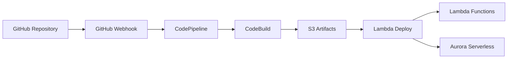

# CI/CD Pipeline Plan for AWS Always Free Tier

## Overview

This document outlines a complete CI/CD pipeline strategy for the Know-It-All Tutor system and future projects, designed to stay within AWS Always Free tier limits while providing professional-grade deployment automation.

## Pipeline Architecture

### High-Level Workflow


## AWS Developer Tools Stack

### 1. Source Stage: GitHub Integration

**Service**: AWS CodeStar Connections (formerly GitHub Integration)
**Cost**: Free
**Purpose**: Connect AWS to your GitHub repository

#### Setup Process:
```yaml
Connection Type: GitHub App
Repository: your-username/tutor-system
Branch Triggers: 
  - main (production)
  - develop (staging)
Webhook Events:
  - Push to main/develop
  - Pull request merge
```

#### GitHub Repository Structure:
```
tutor-system/
├── .github/
│   └── workflows/           # GitHub Actions (optional backup)
├── src/
│   ├── lambda/             # Lambda function code
│   ├── frontend/           # React/Vue frontend
│   └── database/           # Migration scripts
├── infrastructure/
│   ├── cloudformation/     # Infrastructure as Code
│   └── sam/               # SAM templates
├── tests/
│   ├── unit/
│   ├── integration/
│   └── e2e/
├── buildspec.yml          # CodeBuild instructions
├── package.json
└── README.md
```

### 2. Orchestration: AWS CodePipeline

**Service**: AWS CodePipeline
**Cost**: 1 active pipeline free per month
**Purpose**: Orchestrate the entire CI/CD workflow

#### Pipeline Stages:
```yaml
Pipeline Name: tutor-system-pipeline

Stages:
  1. Source:
     - Provider: GitHub (via CodeStar Connection)
     - Repository: tutor-system
     - Branch: main
     - Output: SourceOutput

  2. Build:
     - Provider: CodeBuild
     - Project: tutor-system-build
     - Input: SourceOutput
     - Output: BuildOutput

  3. Deploy-Infrastructure:
     - Provider: CloudFormation
     - Action: CREATE_UPDATE
     - Template: infrastructure/cloudformation/main.yml
     - Input: BuildOutput

  4. Deploy-Application:
     - Provider: Lambda
     - Function: Multiple functions
     - Input: BuildOutput
```

### 3. Build & Test: AWS CodeBuild

**Service**: AWS CodeBuild
**Cost**: 100 minutes/month free (general1.small)
**Purpose**: Build, test, and package application

#### Build Specification (buildspec.yml):
```yaml
version: 0.2

phases:
  install:
    runtime-versions:
      nodejs: 18
      python: 3.11
    commands:
      - echo Installing dependencies
      - npm install
      - pip install -r requirements.txt

  pre_build:
    commands:
      - echo Running tests
      - npm run test:unit
      - npm run test:integration
      - python -m pytest tests/
      - echo Running linting
      - npm run lint
      - flake8 src/

  build:
    commands:
      - echo Building application
      - npm run build
      - echo Packaging Lambda functions
      - cd src/lambda && zip -r ../../lambda-functions.zip .
      - echo Building sentence transformer model package
      - cd ../../final_similarity_model && zip -r ../model.zip .

  post_build:
    commands:
      - echo Build completed
      - echo Preparing deployment artifacts

artifacts:
  files:
    - '**/*'
  secondary-artifacts:
    lambda-package:
      files:
        - lambda-functions.zip
      name: lambda-functions
    model-package:
      files:
        - model.zip
      name: ml-model
    infrastructure:
      files:
        - infrastructure/**/*
      name: infrastructure
```

#### Build Environment:
```yaml
Environment:
  Type: LINUX_CONTAINER
  Image: aws/codebuild/amazonlinux2-x86_64-standard:4.0
  Compute: BUILD_GENERAL1_SMALL  # Free tier eligible
  Privileged: false

Build Timeout: 20 minutes  # Well within free tier limits
```

### 4. Deployment Strategy

#### Option A: Direct Lambda Deployment (Recommended for Always Free)
```yaml
Deployment Type: Direct Lambda Update
Services Updated:
  - Lambda Functions (API endpoints)
  - Lambda Layers (ML model)
  - API Gateway (configuration)
  - Aurora Serverless (migrations via Lambda)

Advantages:
  - No CodeDeploy charges
  - Fastest deployment
  - Simplest configuration
```

#### Option B: CloudFormation Deployment
```yaml
Deployment Type: Infrastructure as Code
Template: CloudFormation/SAM
Resources Managed:
  - Lambda Functions
  - API Gateway
  - Aurora Serverless
  - IAM Roles
  - VPC Configuration

Advantages:
  - Version-controlled infrastructure
  - Rollback capabilities
  - Environment consistency
```

### 5. Artifact Storage: Amazon S3

**Service**: Amazon S3
**Cost**: 5GB free storage
**Purpose**: Store build artifacts between pipeline stages

#### Artifact Management:
```yaml
Bucket Structure:
  tutor-system-pipeline-artifacts/
  ├── source/           # GitHub source code
  ├── build/           # Build outputs
  ├── lambda/          # Lambda deployment packages
  ├── model/           # ML model artifacts
  └── infrastructure/  # CloudFormation templates

Lifecycle Policy:
  - Delete artifacts older than 30 days
  - Keep only last 10 successful builds
  - Compress older artifacts
```

## Environment Strategy

### Multi-Environment Setup
```yaml
Environments:
  Development:
    Branch: develop
    Aurora: Minimal ACU (0.5)
    Lambda: 128MB memory
    Domain: dev-api.tutor-system.com

  Production:
    Branch: main
    Aurora: Auto-scaling (0.5-2 ACU)
    Lambda: 512MB memory
    Domain: api.tutor-system.com
```

### Environment-Specific Configurations:
```yaml
# buildspec-dev.yml
environment_variables:
  - name: ENVIRONMENT
    value: development
  - name: AURORA_MIN_CAPACITY
    value: 0.5
  - name: LAMBDA_MEMORY
    value: 128

# buildspec-prod.yml
environment_variables:
  - name: ENVIRONMENT
    value: production
  - name: AURORA_MIN_CAPACITY
    value: 0.5
  - name: LAMBDA_MEMORY
    value: 512
```

## Testing Strategy in CI/CD

### Test Stages:
```yaml
Unit Tests:
  - Lambda function logic
  - Database query functions
  - ML model evaluation
  - Frontend components

Integration Tests:
  - API endpoint testing
  - Database connectivity
  - ML model integration
  - Authentication flows

End-to-End Tests:
  - Complete user workflows
  - Quiz session management
  - Progress tracking
  - Batch upload functionality
```

### Test Configuration:
```yaml
# In buildspec.yml
test_commands:
  - npm run test:unit -- --coverage
  - npm run test:integration
  - python -m pytest tests/ --cov=src/
  - npm run test:e2e:headless

coverage_threshold: 80%
test_timeout: 10 minutes
```

## Database Migration Strategy

### Migration Pipeline:
```yaml
Migration Process:
  1. Version Check:
     - Compare current DB version with code version
     - Identify required migrations

  2. Backup (Production only):
     - Create Aurora snapshot
     - Store migration rollback scripts

  3. Execute Migrations:
     - Run via Lambda function
     - Apply schema changes
     - Seed new data if needed

  4. Validation:
     - Run post-migration tests
     - Verify data integrity
     - Check application connectivity
```

### Migration Lambda Function:
```javascript
// src/lambda/migrate.js
exports.handler = async (event) => {
  const currentVersion = await getCurrentDBVersion();
  const targetVersion = process.env.TARGET_DB_VERSION;
  
  const migrations = getMigrationsToRun(currentVersion, targetVersion);
  
  for (const migration of migrations) {
    await runMigration(migration);
    await updateDBVersion(migration.version);
  }
  
  return { statusCode: 200, body: 'Migrations completed' };
};
```

## Security and Secrets Management

### AWS Secrets Manager Integration:
```yaml
Secrets Stored:
  - Database connection strings
  - API keys for external services
  - JWT signing keys
  - Third-party service credentials

Access Pattern:
  - Lambda functions retrieve secrets at runtime
  - CodeBuild accesses secrets for testing
  - No secrets in source code or build logs
```

### IAM Roles and Policies:
```yaml
CodeBuild Service Role:
  Permissions:
    - S3: Read/Write to artifact bucket
    - Secrets Manager: Read application secrets
    - CloudWatch: Write build logs
    - Lambda: Update function code

CodePipeline Service Role:
  Permissions:
    - S3: Read/Write artifacts
    - CodeBuild: Start/Stop builds
    - Lambda: Update functions
    - CloudFormation: Deploy infrastructure
```

## Monitoring and Alerting

### CloudWatch Integration:
```yaml
Metrics Tracked:
  - Pipeline success/failure rates
  - Build duration and costs
  - Deployment frequency
  - Application performance post-deployment

Alarms:
  - Pipeline failures
  - Build time exceeding 15 minutes
  - Deployment rollbacks
  - High error rates post-deployment
```

### Notification Strategy:
```yaml
SNS Topics:
  - pipeline-alerts
  - deployment-notifications
  - build-failures

Subscribers:
  - Email: dev-team@company.com
  - Slack: #deployments channel
  - SMS: Critical failures only
```

## Cost Optimization

### Always Free Tier Usage:
```yaml
CodePipeline: 1 active pipeline (FREE)
CodeBuild: 100 minutes/month (FREE)
S3 Storage: 5GB artifacts (FREE)
Lambda: 1M requests, 400K GB-seconds (FREE)
Aurora Serverless: Pay per ACU-second (scales to $0)
API Gateway: 1M requests (FREE)
CloudWatch: Basic monitoring (FREE)

Estimated Monthly Cost: $0-5 (depending on Aurora usage)
```

### Cost Monitoring:
```yaml
Budget Alerts:
  - $5 monthly budget
  - 80% threshold warning
  - 100% threshold alarm

Cost Optimization:
  - Artifact lifecycle policies
  - Aurora auto-pause after 5 minutes
  - Lambda memory optimization
  - Build time optimization
```

## Implementation Phases

### Phase 1: Basic Pipeline (Week 1)
- [ ] Set up GitHub repository
- [ ] Create CodePipeline with basic stages
- [ ] Configure CodeBuild with simple buildspec
- [ ] Deploy single Lambda function

### Phase 2: Complete Application (Week 2-3)
- [ ] Add all Lambda functions
- [ ] Integrate Aurora Serverless deployment
- [ ] Add comprehensive testing
- [ ] Configure environment-specific deployments

### Phase 3: Advanced Features (Week 4)
- [ ] Database migration automation
- [ ] ML model deployment pipeline
- [ ] Monitoring and alerting
- [ ] Performance optimization

### Phase 4: Multi-Project Template (Week 5)
- [ ] Create reusable pipeline templates
- [ ] Document best practices
- [ ] Set up project scaffolding tools
- [ ] Create deployment guides

## Troubleshooting Guide

### Common Issues:
```yaml
Build Failures:
  - Check buildspec.yml syntax
  - Verify dependency versions
  - Review CloudWatch build logs
  - Check IAM permissions

Deployment Failures:
  - Validate CloudFormation templates
  - Check Lambda function sizes
  - Verify Aurora connectivity
  - Review deployment logs

Performance Issues:
  - Optimize build commands
  - Use build caching
  - Minimize artifact sizes
  - Parallel test execution
```

### Debug Commands:
```bash
# Local testing
sam build
sam local start-api
sam local invoke FunctionName

# Pipeline debugging
aws codebuild start-build --project-name tutor-system-build
aws codepipeline get-pipeline-execution --pipeline-name tutor-system-pipeline
aws logs describe-log-groups --log-group-name-prefix /aws/codebuild/
```

## Conclusion

This CI/CD pipeline provides:
- **Professional automation** within Always Free tier limits
- **Scalable architecture** for multiple projects
- **Comprehensive testing** and quality gates
- **Secure deployment** with proper secret management
- **Cost-effective operation** with monitoring and optimization

The pipeline supports your serverless tutor system architecture while establishing patterns for future projects. The modular design allows incremental implementation and easy customization for different project types.

## Next Steps

1. Review and approve this plan
2. Set up GitHub repository structure
3. Create AWS accounts and configure services
4. Implement Phase 1 basic pipeline
5. Iterate through remaining phases
6. Document lessons learned for future projects