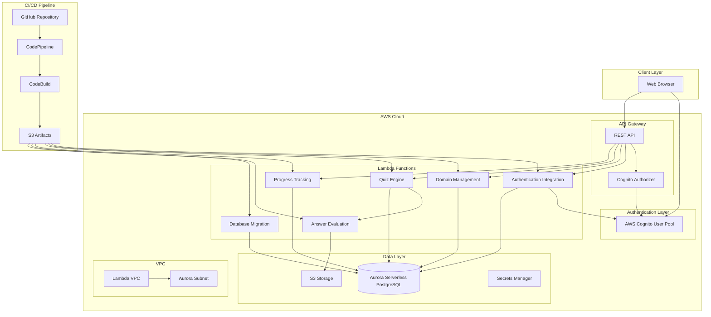
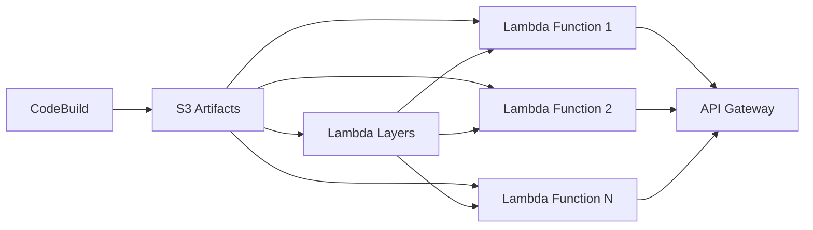
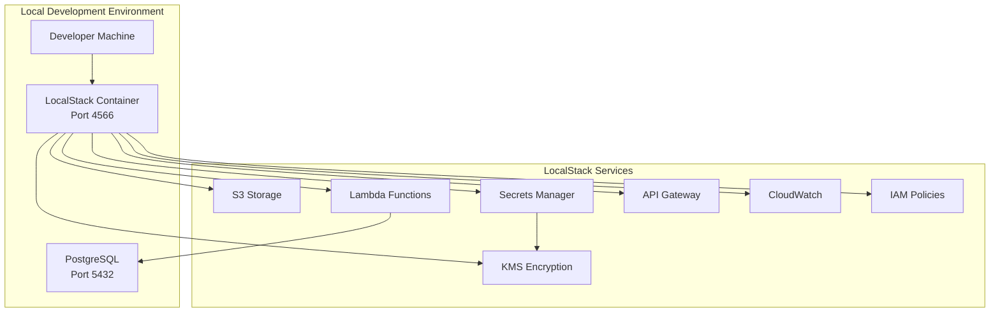

# Design Document: Know-It-All Tutor System

## Overview

The Know-It-All Tutor system is a serverless web application built on AWS Lambda that provides interactive terminology learning through guided quizzes. The system uses a domain-agnostic tree data model to support any knowledge domain without code changes, with initial focus on AWS certification and Python programming concepts.

**Key Design Principles:**
- Domain-agnostic architecture separating content from structure
- Serverless-first approach for scalability and cost efficiency
- Semantic answer evaluation for intelligent feedback
- Progressive learning with persistent progress tracking
- Professional UI/UX design optimized for learning effectiveness
- Accessibility-first approach with WCAG 2.1 AA compliance

## User Interface Design

### Design Philosophy

The Know-It-All Tutor interface follows a **Balanced Professional Learning** aesthetic that serves professionals preparing for AWS certification and learning Python. The design balances the seriousness of professional development with the approachability needed for effective learning.

**Core Brand Attributes:**
- **Approachable**: Learning feels welcoming, not intimidating
- **Intelligent**: Sophisticated without being overwhelming
- **Progressive**: Clear sense of advancement and achievement
- **Trustworthy**: Reliable platform for serious learning goals
- **Energizing**: Motivating and encouraging continued engagement

### Visual Design System

**See**: Complete UI design documentation and artifacts:
- **Interactive Artifacts**: `/artifacts/` directory contains professional HTML design deliverables
  - `sitemap.html` - Interactive information architecture
  - `user_flow_onboarding.html` - Complete user journey mapping
  - `wireframe_dashboard.html` - Responsive dashboard layouts
  - `wireframe_quiz_interface.html` - Interactive learning interface
  - `component_library.html` - Complete design system and components
- **Design Documentation**: `./ui/` directory contains detailed design specifications
  - `ui_design.md` - Design plan and principles
  - `design_system.md` - Component library specifications
  - `wireframes.md` - Low-fidelity layout documentation
  - `user_flows.md` - User journey diagrams and decision points
  - `sitemap.md` - Information architecture documentation
  - `mood_boards_style_tiles.md` - Visual design direction
  - `technical_specifications.md` - Implementation details and handoff specs

#### Color Palette
```css
/* Primary Colors */
--color-primary-600: #2563EB;    /* Trustworthy, professional */
--color-primary-700: #1D4ED8;    /* Authority, depth */
--color-primary-100: #DBEAFE;    /* Calm, spacious */

/* Semantic Colors */
--color-success-600: #059669;    /* Achievement, correct answers */
--color-warning-600: #D97706;    /* Attention, needs review */
--color-error-600: #DC2626;      /* Incorrect, urgent */
--color-info-600: #0891B2;       /* Helpful information */

/* Neutral Colors */
--color-gray-900: #111827;       /* Primary text */
--color-gray-500: #6B7280;       /* Secondary text */
--color-gray-400: #9CA3AF;       /* Muted text */
--color-gray-50: #F9FAFB;        /* Background */
```

#### Typography System
```css
/* Primary Typeface: Inter */
--font-family-primary: 'Inter', system-ui, sans-serif;
--font-family-mono: 'JetBrains Mono', monospace;

/* Type Scale */
--text-display-large: 48px/56px;   /* Hero headings */
--text-heading-large: 24px/32px;   /* Section headers */
--text-body-medium: 16px/24px;     /* Standard text */
--text-caption: 12px/16px;         /* Metadata, labels */
```

#### Spacing System
```css
/* Base Unit: 4px */
--space-xs: 4px;    /* Tight spacing */
--space-sm: 8px;    /* Close elements */
--space-md: 16px;   /* Standard spacing */
--space-lg: 24px;   /* Section spacing */
--space-xl: 32px;   /* Major sections */
--space-2xl: 48px;  /* Page sections */
```

### Information Architecture

The system follows a clear hierarchical structure optimized for learning workflows:

```
Know-It-All Tutor
├── Landing Page (/)
├── Authentication (/auth)
│   ├── Login, Register, Password Reset
├── Student Dashboard (/dashboard)
│   ├── Progress Overview, Domain Library, Profile
├── Learning Interface (/learn)
│   ├── Domain Selection, Quiz Interface, Results
├── Content Management (/create)
│   ├── Domain Creation, Term Management, Bulk Import
└── Admin Panel (/admin) [Admin Only]
    ├── Batch Upload, Content Moderation, Analytics
```

### User Experience Patterns

#### Progressive Learning Focus
- **Clear progress indicators** with visual feedback and achievement celebration
- **Guided learning paths** with logical progression through knowledge domains
- **Immediate feedback** on quiz performance with semantic answer evaluation
- **Adaptive difficulty** based on user performance and mastery levels

#### Domain-Agnostic Interface
- **Consistent interaction patterns** regardless of subject matter (AWS, Python, etc.)
- **Flexible content display** that adapts to different term types and complexity
- **Universal progress tracking** that works across all knowledge domains
- **Scalable navigation** that handles growing content libraries

#### Accessibility & Inclusion
- **WCAG 2.1 AA compliance** with 4.5:1 color contrast ratios
- **Keyboard navigation** support for all interactive elements
- **Screen reader optimization** with semantic HTML and ARIA labels
- **Motor accessibility** with 44px minimum touch targets
- **Cognitive accessibility** through progressive disclosure and clear mental models

### Responsive Design Strategy

#### Breakpoint System
```css
/* Mobile First Approach */
--breakpoint-sm: 640px;   /* Small devices */
--breakpoint-md: 768px;   /* Medium devices */
--breakpoint-lg: 1024px;  /* Large devices */
--breakpoint-xl: 1280px;  /* Extra large devices */
```

#### Layout Adaptations
- **Mobile (320px-767px)**: Single column, stacked navigation, touch-optimized controls
- **Tablet (768px-1023px)**: Two-column layouts, collapsible sidebars, hybrid interactions
- **Desktop (1024px+)**: Multi-column layouts, persistent navigation, keyboard shortcuts

### Component Architecture

#### Atomic Design System
The interface uses a comprehensive component library with:

**Base Components:**
- Buttons (Primary, Secondary, Tertiary, Danger) in 3 sizes
- Form elements (Inputs, Textareas, Select dropdowns) with validation states
- Cards (Default, Elevated, Interactive) with consistent padding and shadows
- Progress indicators (Linear, Circular) with smooth animations

**Composite Components:**
- Quiz Question Cards with term display and answer input
- Domain Cards with progress tracking and action buttons
- Navigation components with responsive behavior
- Dashboard widgets with real-time data updates

**Layout Components:**
- Responsive grid system with 12-column layout
- Container system with max-widths and responsive padding
- Flexible spacing utilities based on 4px base unit

### Frontend Technology Stack

```typescript
interface TechStack {
  framework: 'React 18.2+';
  language: 'TypeScript 5.0+';
  styling: 'Tailwind CSS 3.3+';
  stateManagement: 'React Context + useReducer';
  routing: 'React Router 6.8+';
  httpClient: 'Axios 1.3+';
  formHandling: 'React Hook Form 7.43+';
  testing: 'Jest + React Testing Library';
  bundler: 'Vite 4.1+';
  deployment: 'AWS S3 + CloudFront';
}
```

### Performance Targets
- **First Contentful Paint**: < 1.5 seconds
- **Time to Interactive**: < 3 seconds
- **Lighthouse Score**: > 90 across all metrics
- **Bundle Size**: < 250KB gzipped initial bundle
- **Mobile Performance**: Full feature parity with desktop

### Key Interface Screens

#### Student Dashboard
- **Progress overview** with completion percentages and streak tracking
- **Quick actions** for continuing quizzes and starting new domains
- **Recent activity** feed with achievements and milestones
- **Personalized recommendations** based on learning patterns

#### Quiz Interface
- **Focused design** with large, centered term display to minimize distractions
- **Progress tracking** with visual indicators and session statistics
- **Immediate feedback** with similarity scoring and constructive guidance
- **Learning aids** including contextual hints and examples
- **Session management** with pause/resume functionality

#### Content Creation
- **Guided workflows** for domain and term creation
- **Bulk import** functionality with JSON format validation
- **Preview modes** for testing content before publication
- **Validation tools** ensuring content quality and consistency

#### Admin Panel
- **Batch upload interface** with drag-and-drop file handling
- **Content moderation** tools for reviewing user submissions
- **Analytics dashboard** with usage metrics and performance insights
- **User management** capabilities for support and administration

### Design Validation

The UI design has been validated through:
- **Accessibility audits** ensuring WCAG 2.1 AA compliance
- **Responsive testing** across all target devices and browsers
- **Performance optimization** meeting Core Web Vitals standards
- **Usability principles** following established learning interface patterns

**Professional Artifacts**: All design specifications, wireframes, user flows, and component libraries are available as:
- **Interactive HTML files** in the `/artifacts/` directory for stakeholder presentations and developer reference
- **Detailed documentation** in the `./ui/` directory for comprehensive design specifications and implementation guidance

This provides complete documentation for development teams, stakeholders, and future maintenance while maintaining professional presentation quality.

## Frontend Architecture

### Technology Stack Integration

The frontend architecture integrates seamlessly with the serverless backend while providing a rich, interactive learning experience:

```typescript
// Frontend-Backend Integration Pattern
interface APIIntegration {
  authentication: 'Cognito JWT tokens with automatic refresh via AWS Amplify Auth';
  stateManagement: 'React Context for global state, local state for components';
  errorHandling: 'Centralized error boundary with user-friendly messages';
  caching: 'React Query for server state management and caching';
  realtime: 'WebSocket connections for live progress updates';
}
```

### Component-Service Integration

The UI components map directly to backend services:

```typescript
// Component-Service Mapping
interface ComponentServiceMap {
  AuthComponents: 'Authentication Service';
  DashboardComponents: 'Progress Tracking Service + Domain Management Service';
  QuizComponents: 'Quiz Engine + Answer Evaluation Service';
  ContentComponents: 'Domain Management Service';
  AdminComponents: 'Batch Upload Service + User Management';
}
```

### State Management Architecture

```typescript
// Global Application State
interface AppState {
  user: User | null;
  currentDomain: Domain | null;
  quizSession: QuizSession | null;
  progress: ProgressData;
  notifications: Notification[];
  ui: {
    theme: 'light' | 'dark';
    sidebarOpen: boolean;
    loading: boolean;
  };
}

// State Management Pattern
const useAppState = () => {
  const [state, dispatch] = useReducer(appReducer, initialState);
  
  // Sync with backend services
  useEffect(() => {
    syncUserProgress();
    subscribeToUpdates();
  }, [state.user]);
  
  return { state, dispatch };
};
```

### API Integration Patterns

```typescript
// Centralized API Client
class APIClient {
  private baseURL = process.env.REACT_APP_API_BASE_URL;
  private authToken: string | null = null;

  // Authentication integration
  async login(credentials: LoginRequest): Promise<LoginResponse> {
    const response = await this.post('/auth/login', credentials);
    this.setAuthToken(response.token);
    return response;
  }

  // Quiz integration with real-time feedback
  async submitAnswer(sessionId: string, answer: string): Promise<AnswerResult> {
    const result = await this.post(`/quiz/answer`, { sessionId, answer });
    
    // Update UI immediately with feedback
    this.notifyAnswerResult(result);
    return result;
  }

  // Progress tracking integration
  async getProgressDashboard(): Promise<ProgressDashboard> {
    return this.get('/progress/dashboard');
  }
}
```

### Performance Optimization

```typescript
// Code Splitting Strategy
const Dashboard = lazy(() => import('./pages/Dashboard'));
const QuizInterface = lazy(() => import('./pages/QuizInterface'));
const ContentCreation = lazy(() => import('./pages/ContentCreation'));

// Memoization for expensive operations
const QuizQuestion = memo(({ term, onSubmit }: QuizQuestionProps) => {
  const memoizedValidation = useMemo(() => 
    validateAnswer(term.definition), [term.definition]
  );
  
  return <QuestionCard term={term} onSubmit={onSubmit} />;
});

// Virtual scrolling for large domain lists
const DomainList = ({ domains }: { domains: Domain[] }) => {
  const virtualizer = useVirtualizer({
    count: domains.length,
    getScrollElement: () => parentRef.current,
    estimateSize: () => 200,
  });

  return (
    <div ref={parentRef} className="domain-list">
      {virtualizer.getVirtualItems().map(virtualRow => (
        <DomainCard key={virtualRow.key} domain={domains[virtualRow.index]} />
      ))}
    </div>
  );
};
```

### High-Level Architecture


    DOMAIN --> AURORA
    QUIZ --> AURORA
    PROGRESS --> AURORA
    MIGRATE --> AURORA
    EVAL --> S3
    
    LAMBDA_VPC --> AURORA_VPC
```

### Serverless Architecture Pattern

Based on research into AWS Lambda, Aurora Serverless, and Cognito integration patterns, the system follows these architectural decisions:

- **AWS Cognito User Pool**: Centralized user authentication and authorization with built-in security features
- **Cognito Authorizers**: API Gateway uses Cognito JWT tokens for automatic request authorization
- **Lambda Functions in VPC**: All Lambda functions operate within a VPC to securely access Aurora Serverless PostgreSQL
- **Connection Pooling**: Use RDS Proxy for efficient database connection management across Lambda invocations
- **Stateless Design**: Each Lambda function is stateless, with user state managed by Cognito and data persisted in Aurora PostgreSQL
- **Event-Driven**: Functions respond to API Gateway events and Cognito triggers
- **Auto-Scaling Database**: Aurora Serverless v2 scales from 0 ACU to handle variable workloads automatically
- **Direct Lambda Deployment**: CI/CD pipeline deploys directly to Lambda functions without intermediate deployment services, optimizing for Always Free tier usage

## AWS Cognito Configuration

### User Pool Configuration

The system uses AWS Cognito User Pool for comprehensive user authentication and management:

```typescript
interface CognitoUserPoolConfig {
  // Basic configuration
  userPoolName: 'know-it-all-tutor-users'
  aliasAttributes: ['email']
  usernameAttributes: ['email']
  
  // Password policy
  passwordPolicy: {
    minimumLength: 8
    requireUppercase: true
    requireLowercase: true
    requireNumbers: true
    requireSymbols: true
    temporaryPasswordValidityDays: 7
  }
  
  // Account recovery
  accountRecoverySetting: {
    recoveryMechanisms: [
      { name: 'verified_email', priority: 1 }
    ]
  }
  
  // Email configuration
  emailConfiguration: {
    emailSendingAccount: 'DEVELOPER'  // Use SES for production, COGNITO_DEFAULT for LocalStack
    sourceArn: 'arn:aws:ses:us-east-1:account:identity/noreply@know-it-all-tutor.com'
    replyToEmailAddress: 'noreply@know-it-all-tutor.com'
  }
  
  // MFA configuration
  mfaConfiguration: 'OPTIONAL'
  enabledMfas: ['SMS_MFA', 'SOFTWARE_TOKEN_MFA']
  
  // User attributes
  schema: [
    {
      name: 'email'
      attributeDataType: 'String'
      required: true
      mutable: true
    },
    {
      name: 'given_name'
      attributeDataType: 'String'
      required: false
      mutable: true
    },
    {
      name: 'family_name'
      attributeDataType: 'String'
      required: false
      mutable: true
    }
  ]
  
  // Lambda triggers
  lambdaTriggers: {
    preSignUp: 'arn:aws:lambda:region:account:function:cognito-pre-signup'
    postConfirmation: 'arn:aws:lambda:region:account:function:cognito-post-confirmation'
    preAuthentication: 'arn:aws:lambda:region:account:function:cognito-pre-auth'
    postAuthentication: 'arn:aws:lambda:region:account:function:cognito-post-auth'
  }
}
```

### User Pool Client Configuration

```typescript
interface CognitoUserPoolClientConfig {
  clientName: 'know-it-all-tutor-web-client'
  generateSecret: false  // Public client for web applications
  
  // Authentication flows
  explicitAuthFlows: [
    'ALLOW_USER_SRP_AUTH',
    'ALLOW_REFRESH_TOKEN_AUTH',
    'ALLOW_USER_PASSWORD_AUTH'  // For migration purposes
  ]
  
  // Token validity
  accessTokenValidity: 1  // 1 hour
  idTokenValidity: 1      // 1 hour
  refreshTokenValidity: 30 // 30 days
  
  // OAuth configuration
  supportedIdentityProviders: ['COGNITO']
  callbackUrls: [
    'https://app.know-it-all-tutor.com/auth/callback',
    'http://localhost:3000/auth/callback'  // Development
  ]
  logoutUrls: [
    'https://app.know-it-all-tutor.com/auth/logout',
    'http://localhost:3000/auth/logout'    // Development
  ]
  
  // OAuth scopes
  allowedOAuthScopes: ['openid', 'email', 'profile']
  allowedOAuthFlows: ['code']
  allowedOAuthFlowsUserPoolClient: true
}
```

### API Gateway Integration

```typescript
interface CognitoAuthorizerConfig {
  name: 'CognitoUserPoolAuthorizer'
  type: 'COGNITO_USER_POOLS'
  identitySource: 'method.request.header.Authorization'
  userPoolArn: '${CognitoUserPoolArn}'
  
  // Claims validation
  authorizerResultTtlInSeconds: 300
  
  // Integration with API Gateway methods
  protectedRoutes: [
    'GET /api/domains',
    'POST /api/domains',
    'GET /api/quiz/*',
    'POST /api/quiz/*',
    'GET /api/progress/*'
  ]
}
```

### Lambda Trigger Functions

#### Pre-Signup Trigger
```python
def lambda_handler(event, context):
    """
    Pre-signup trigger to validate user registration
    """
    # Auto-confirm users (skip email verification for development)
    if event['triggerSource'] == 'PreSignUp_SignUp':
        event['response']['autoConfirmUser'] = True
        event['response']['autoVerifyEmail'] = True
    
    return event
```

#### Post-Confirmation Trigger
```python
def lambda_handler(event, context):
    """
    Post-confirmation trigger to create user profile in database
    """
    if event['triggerSource'] == 'PostConfirmation_ConfirmSignUp':
        user_id = event['request']['userAttributes']['sub']
        email = event['request']['userAttributes']['email']
        
        # Create user profile in PostgreSQL
        create_user_profile(user_id, email)
    
    return event
```

### Security Configuration

```typescript
interface CognitoSecurityConfig {
  // Advanced security features
  advancedSecurityMode: 'ENFORCED'
  
  // Risk configuration
  riskConfiguration: {
    compromisedCredentialsRiskConfiguration: {
      actions: {
        eventAction: 'BLOCK'
      }
    }
    accountTakeoverRiskConfiguration: {
      actions: {
        highAction: { eventAction: 'BLOCK', notify: true }
        mediumAction: { eventAction: 'MFA_IF_CONFIGURED', notify: true }
        lowAction: { eventAction: 'NO_ACTION', notify: false }
      }
    }
  }
  
  // Device configuration
  deviceConfiguration: {
    challengeRequiredOnNewDevice: true
    deviceOnlyRememberedOnUserPrompt: false
  }
}
```

## Deployment Strategy

### Direct Lambda Deployment Architecture

The system uses a direct Lambda deployment strategy optimized for AWS Always Free tier, eliminating the need for AWS CodeDeploy and reducing operational complexity.

**See**: [CI/CD Pipeline Plan](./ci-cd_plan.md) for comprehensive deployment automation and pipeline configuration.

#### Deployment Flow



#### Lambda Function Architecture

```typescript
// Deployment configuration for each Lambda function
interface LambdaDeploymentConfig {
  functionName: string
  runtime: 'nodejs18.x' | 'python3.11'
  handler: string
  memorySize: number
  timeout: number
  environment: Record<string, string>
  layers?: string[]
  vpcConfig?: {
    subnetIds: string[]
    securityGroupIds: string[]
  }
}

const deploymentConfig: LambdaDeploymentConfig[] = [
  {
    functionName: 'tutor-auth',
    runtime: 'nodejs18.x',
    handler: 'auth/index.handler',
    memorySize: 256,
    timeout: 30,
    environment: {
      AURORA_ENDPOINT: '${AuroraEndpoint}',
      JWT_SECRET: '${JWTSecret}'
    }
  },
  {
    functionName: 'tutor-quiz-engine',
    runtime: 'python3.11',
    handler: 'quiz/handler.main',
    memorySize: 512,
    timeout: 60,
    layers: ['sentence-transformer-layer'],
    environment: {
      AURORA_ENDPOINT: '${AuroraEndpoint}',
      MODEL_PATH: '/opt/final_similarity_model'
    }
  }
]
```

#### Lambda Layers Strategy

```yaml
Layers:
  sentence-transformer-layer:
    Description: ML model and dependencies for answer evaluation
    Content: 
      - final_similarity_model/
      - python packages (torch, transformers, sentence-transformers)
    Runtime: python3.11
    Size: ~200MB

  common-utilities-layer:
    Description: Shared utilities and database connection logic
    Content:
      - database connection pooling
      - common validation functions
      - logging utilities
    Runtime: nodejs18.x | python3.11
    Size: ~10MB
```

#### Database Migration Integration

```typescript
// Database migration Lambda function
interface MigrationConfig {
  functionName: 'tutor-db-migrate'
  trigger: 'CodePipeline deployment'
  process: [
    'Check current database version',
    'Identify required migrations',
    'Execute migrations in transaction',
    'Update version tracking',
    'Validate post-migration state'
  ]
}

// Migration execution in CI/CD pipeline
const migrationStep = {
  stage: 'Deploy-Database',
  action: 'Invoke Lambda',
  function: 'tutor-db-migrate',
  input: {
    targetVersion: '${BuildVersion}',
    environment: '${DeploymentEnvironment}'
  }
}
```

### Deployment Environments

#### Development Environment
```yaml
Environment: development
Branch: develop
Lambda Configuration:
  Memory: 128-256 MB (cost optimization)
  Timeout: 30 seconds
  Concurrency: 10 (sufficient for testing)
Aurora Configuration:
  Min Capacity: 0.5 ACU
  Max Capacity: 1 ACU
  Auto Pause: 5 minutes
API Gateway:
  Throttling: 100 requests/second
  Caching: Disabled
```

#### Production Environment
```yaml
Environment: production
Branch: main
Lambda Configuration:
  Memory: 256-512 MB (performance optimization)
  Timeout: 60 seconds
  Concurrency: 100 (handle traffic spikes)
Aurora Configuration:
  Min Capacity: 0.5 ACU
  Max Capacity: 2 ACU
  Auto Pause: 15 minutes
API Gateway:
  Throttling: 1000 requests/second
  Caching: Enabled (5 minutes TTL)
```

### Deployment Automation

#### CodePipeline Integration
```yaml
Pipeline Stages:
  1. Source (GitHub):
     - Trigger: Push to main/develop
     - Output: Source code artifacts

  2. Build (CodeBuild):
     - Test execution
     - Lambda package creation
     - Layer package creation
     - Output: Deployment artifacts

  3. Deploy-Infrastructure:
     - Update API Gateway configuration
     - Create/update Lambda layers
     - Configure environment variables

  4. Deploy-Functions:
     - Update Lambda function code
     - Execute database migrations
     - Run post-deployment tests

  5. Validate:
     - Health checks
     - Integration tests
     - Performance validation
```

#### Rollback Strategy
```typescript
interface RollbackConfig {
  trigger: 'Deployment failure or manual intervention'
  process: [
    'Identify last known good version',
    'Revert Lambda function code',
    'Rollback database migrations (if safe)',
    'Restore previous API Gateway configuration',
    'Validate system health'
  ]
  automation: 'Automatic on critical failures'
  manual_approval: 'Required for production rollbacks'
}
```

### Always Free Tier Optimization

#### Cost-Effective Deployment Practices
```yaml
Lambda Optimization:
  - Right-size memory allocation based on profiling
  - Use provisioned concurrency sparingly (not in free tier)
  - Optimize cold start performance
  - Implement efficient connection pooling

Aurora Optimization:
  - Configure aggressive auto-pause settings
  - Use connection pooling to minimize ACU usage
  - Optimize queries to reduce compute time
  - Monitor and alert on ACU consumption

S3 Optimization:
  - Implement artifact lifecycle policies
  - Compress deployment packages
  - Use S3 Transfer Acceleration sparingly
  - Monitor storage usage against 5GB limit
```

#### Monitoring and Alerting
```yaml
CloudWatch Metrics:
  - Lambda invocation count and duration
  - Aurora ACU consumption
  - API Gateway request count and latency
  - S3 storage utilization

Alarms:
  - Lambda error rate > 1%
  - Aurora ACU usage approaching limits
  - API Gateway 4xx/5xx error rates
  - S3 storage > 4GB (80% of free tier)

Cost Monitoring:
  - Daily cost reports
  - Budget alerts at $3 and $5 thresholds
  - Free tier usage tracking
```

## Development Environment and Local Testing

### LocalStack Integration

The Know-It-All Tutor system uses **LocalStack** for local AWS development and testing, providing a fully functional local AWS cloud stack that enables offline development with identical APIs to production AWS services.

#### LocalStack Architecture



#### LocalStack Configuration

**Services Enabled:**
- **Lambda**: Serverless function execution
- **S3**: Object storage for ML models and static assets
- **Secrets Manager**: Encrypted credential storage
- **KMS**: Key Management Service for encryption
- **API Gateway**: REST API endpoints
- **CloudWatch**: Logging and monitoring
- **IAM**: Identity and access management

**Database Strategy:**
- **PostgreSQL**: Uses existing system PostgreSQL service (port 5432)
- **Connection**: Direct connection to system PostgreSQL for better performance
- **Alternative**: Containerized PostgreSQL on port 5433 for complete isolation

#### Development Workflow

```bash
# Daily development workflow
make local-dev          # Start LocalStack + setup database
make localstack-verify  # Verify all services are working
make test-secrets       # Test Secrets Manager + KMS integration
make local-test         # Run integration tests
make localstack-stop    # Stop LocalStack (PostgreSQL keeps running)
```

#### LocalStack vs AWS Compatibility

| Feature | LocalStack | AWS Production | Compatibility |
|---------|------------|----------------|---------------|
| Lambda Functions | ✅ Full support | ✅ Native | 100% |
| Secrets Manager | ✅ Full support | ✅ Native | 100% |
| KMS Encryption | ✅ Full support | ✅ Native | 100% |
| S3 Storage | ✅ Full support | ✅ Native | 100% |
| API Gateway | ✅ Full support | ✅ Native | 100% |
| IAM Policies | ✅ Full support | ✅ Native | 100% |

### Secrets Management Architecture

The system implements **industry-standard encrypted credential management** using AWS Secrets Manager with KMS encryption, providing secure storage and retrieval of sensitive configuration data.

#### Secrets Manager + KMS Integration

```typescript
// Secrets Manager Client Architecture
interface SecretsManagerClient {
  // Automatic KMS decryption
  getSecret(secretName: string): Promise<SecretData>
  
  // Environment-aware secret retrieval
  getDatabaseCredentials(): Promise<DatabaseConfig>
  getJWTConfig(): Promise<JWTConfig>
  getMLModelConfig(): Promise<MLConfig>
  
  // Caching and performance optimization
  clearCache(): void
  healthCheck(): Promise<boolean>
}

// Database Integration with Secrets Manager
class DatabaseManager {
  private async _getDbConfig(): Promise<DatabaseConfig> {
    try {
      // Primary: Get credentials from Secrets Manager (KMS encrypted)
      const credentials = await getDatabase Credentials();
      return {
        host: credentials.host,
        port: credentials.port,
        database: credentials.database,
        user: credentials.username,
        password: credentials.password // Automatically KMS decrypted
      };
    } catch (error) {
      // Fallback: Environment variables for development
      return this.getEnvironmentConfig();
    }
  }
}
```

#### Secret Storage Structure

**Database Credentials** (`tutor-system/database`):
```json
{
  "host": "localhost",
  "port": 5432,
  "database": "tutor_system",
  "username": "tutor_user",
  "password": "encrypted_password"
}
```

**JWT Configuration** (`tutor-system/jwt`):
```json
{
  "secret_key": "kms_encrypted_jwt_secret",
  "algorithm": "HS256",
  "expiration_hours": 24
}
```

**ML Model Configuration** (`tutor-system/ml-model`):
```json
{
  "model_path": "./final_similarity_model",
  "similarity_threshold": 0.7,
  "batch_size": 32
}
```

#### KMS Encryption Strategy

**Custom KMS Key:**
- **Alias**: `alias/tutor-system-secrets`
- **Usage**: Encrypt all application secrets
- **Permissions**: Service-scoped access via IAM conditions
- **Rotation**: Supports automatic key rotation

**IAM Policy Integration:**
```typescript
// Secrets Manager access requires both permissions
const secretsManagerPolicy = {
  "Effect": "Allow",
  "Action": [
    "secretsmanager:GetSecretValue",
    "secretsmanager:DescribeSecret"
  ],
  "Resource": "arn:aws:secretsmanager:*:*:secret:tutor-system/*"
};

const kmsDecryptPolicy = {
  "Effect": "Allow", 
  "Action": ["kms:Decrypt"],
  "Resource": "arn:aws:kms:*:*:key/*",
  "Condition": {
    "StringEquals": {
      "kms:ViaService": "secretsmanager.us-east-1.amazonaws.com"
    }
  }
};
```

#### Security Benefits

1. **Encryption at Rest**: All secrets encrypted with customer-managed KMS keys
2. **Least Privilege Access**: IAM policies grant minimal required permissions
3. **Audit Trail**: All secret access logged via CloudTrail
4. **Automatic Rotation**: Supports Lambda-based credential rotation
5. **Environment Isolation**: Separate secrets per environment (dev/staging/prod)
6. **Fallback Strategy**: Graceful degradation to environment variables in development

#### Key Rotation Policy

The system implements **environment-specific automatic key rotation** to maintain security:

**Rotation Schedule:**
- **Local Development**: Every 2 days (rapid testing)
- **Staging Environment**: Every 30 days (testing rotation procedures)
- **Production Environment**: Every 180 days (6 months - industry standard)

**Rotated Secrets:**
- Database credentials (username/password)
- JWT signing secrets
- API keys for external services

**Rotation Process:**
1. **Create**: Generate new credentials using rotation Lambda
2. **Set**: Update service with new credentials (database user password)
3. **Test**: Verify new credentials work correctly
4. **Finish**: Promote new version to AWSCURRENT

**Implementation:**
```typescript
// Rotation Lambda function configuration
const rotationConfig = {
  environment: process.env.ENVIRONMENT,
  rotationIntervals: {
    production: 180,  // 6 months
    staging: 30,      // 1 month  
    development: 2,   // 2 days
    local: 2          // 2 days (LocalStack)
  }
};

// Automatic rotation scheduling
await secretsManager.rotateSecret({
  SecretId: secretArn,
  RotationLambdaArn: rotationLambdaArn,
  RotationRules: {
    AutomaticallyAfterDays: rotationConfig.rotationIntervals[environment]
  }
});
```

**Testing Rotation:**
```bash
# Test rotation policies
make test-rotation          # LocalStack (2 days)
make test-rotation-aws      # AWS (180 days)
make configure-rotation     # Configure missing policies

# Manual testing
python3 scripts/test_rotation_policy.py --localstack --configure
```

#### Development Testing

**Integration Testing:**
```bash
# Test complete secrets integration
make test-secrets

# Test Lambda function with secrets
make test-lambda-secrets

# Verify KMS encryption
python3 scripts/test_kms_secrets.py
```

**Example Lambda Function Usage:**
```typescript
// Lambda function using encrypted credentials
export const handler = async (event: APIGatewayEvent) => {
  try {
    // Automatically retrieves and decrypts credentials
    const dbCredentials = await getDatabaseCredentials();
    const jwtConfig = await getJWTConfig();
    
    // Use credentials for database connection
    const connection = await createDatabaseConnection(dbCredentials);
    
    // Process request with secure configuration
    return await processRequest(event, connection, jwtConfig);
    
  } catch (error) {
    logger.error('Failed to access encrypted credentials', error);
    return createErrorResponse(500, 'Internal server error');
  }
};
```

### Local Development Benefits

1. **Cost-Free Development**: No AWS charges for local development
2. **Offline Capability**: Full development without internet connectivity
3. **Fast Iteration**: Instant feedback without cloud latency
4. **Identical APIs**: Same code works in LocalStack and AWS
5. **Security Testing**: Verify encryption and IAM policies locally
6. **Integration Testing**: Test complete workflows end-to-end

### Production Deployment Compatibility

The LocalStack development environment ensures **100% compatibility** with AWS production:

- **Same Code**: Identical Lambda functions, IAM policies, and configurations
- **Same APIs**: All AWS SDK calls work identically
- **Same Security**: KMS encryption and Secrets Manager integration
- **Same Architecture**: Serverless patterns and connection pooling
- **Same Testing**: Integration tests run against both environments

This development approach provides confidence that local testing accurately represents production behavior while enabling rapid, cost-effective development cycles.

### Core Components

#### 1. AWS Cognito Authentication Service
**Responsibility**: User registration, login, session management, email verification, password reset, and MFA through AWS Cognito User Pool
**Interface**:
```typescript
interface CognitoAuthService {
  // Core authentication
  register(email: string, username: string, password: string): Promise<CognitoUser>
  confirmRegistration(username: string, confirmationCode: string): Promise<void>
  login(email: string, password: string): Promise<CognitoAuthResult>
  logout(accessToken: string): Promise<void>
  
  // Token management
  validateToken(accessToken: string): Promise<CognitoUser>
  refreshToken(refreshToken: string): Promise<CognitoAuthResult>
  
  // Password management
  forgotPassword(email: string): Promise<void>
  confirmForgotPassword(email: string, confirmationCode: string, newPassword: string): Promise<void>
  changePassword(accessToken: string, oldPassword: string, newPassword: string): Promise<void>
  
  // Email verification
  resendConfirmationCode(username: string): Promise<void>
  
  // Multi-factor authentication
  enableMFA(accessToken: string, mfaType: 'SMS' | 'TOTP'): Promise<void>
  confirmMFA(session: string, mfaCode: string): Promise<CognitoAuthResult>
}

interface CognitoAuthResult {
  accessToken: string
  idToken: string
  refreshToken: string
  user: CognitoUser
}

interface CognitoUser {
  id: string
  email: string
  username: string
  emailVerified: boolean
  mfaEnabled: boolean
  groups: string[]
  customAttributes: Record<string, string>
}
```

#### 2. Domain Management Service
**Responsibility**: CRUD operations for knowledge domains and terms
**Interface**:
```typescript
interface DomainService {
  createDomain(userId: string, domain: KnowledgeDomain): Promise<string>
  addTerms(domainId: string, terms: Term[]): Promise<void>
  getDomains(userId: string): Promise<KnowledgeDomain[]>
  getDomainById(domainId: string): Promise<KnowledgeDomain>
  validateDomain(domain: KnowledgeDomain): Promise<ValidationResult>
}
```

#### 3. Quiz Engine
**Responsibility**: Quiz session management and question presentation
**Interface**:
```typescript
interface QuizEngine {
  startQuiz(userId: string, domainId: string): Promise<QuizSession>
  getNextQuestion(sessionId: string): Promise<Question | null>
  submitAnswer(sessionId: string, questionId: string, answer: string): Promise<AnswerResult>
  pauseQuiz(sessionId: string): Promise<void>
  resumeQuiz(sessionId: string): Promise<QuizSession>
  completeQuiz(sessionId: string): Promise<QuizSummary>
}
```

#### 4. Answer Evaluation Service
**Responsibility**: Semantic comparison of student answers with correct definitions using a custom fine-tuned sentence transformer model

**See**: [Model Interface Documentation](./model_interface.md) for detailed implementation patterns and usage examples.

**Interface**:
```typescript
interface AnswerEvaluator {
  evaluateAnswer(studentAnswer: string, correctAnswer: string, threshold?: number): Promise<EvaluationResult>
  generateFeedback(evaluation: EvaluationResult): Promise<string>
  batchEvaluate(answerPairs: Array<[string, string]>, threshold?: number): Promise<EvaluationResult[]>
}
```

#### 5. Progress Tracking Service
**Responsibility**: Recording and retrieving student progress metrics
**Interface**:
```typescript
interface ProgressTracker {
  recordAttempt(userId: string, termId: string, correct: boolean, score: number): Promise<void>
  getProgress(userId: string, domainId?: string): Promise<Progress>
  calculateMastery(userId: string, termId: string): Promise<MasteryLevel>
  getProgressDashboard(userId: string): Promise<ProgressDashboard>
}
```

#### 6. Batch Upload Service
**Responsibility**: Administrator functionality for batch importing knowledge domains
**Interface**:
```typescript
interface BatchUploadService {
  validateFormat(fileContent: string): Promise<ValidationResult>
  uploadDomains(adminId: string, batchData: BatchUploadData): Promise<UploadResult>
  getUploadHistory(adminId: string): Promise<UploadRecord[]>
}

interface BatchUploadData {
  batch_metadata: {
    filename: string
    version: string
    created_date: string
    total_domains: number
    total_terms: number
  }
  domains: Array<{
    node_type: 'domain'
    data: {
      name: string
      description: string
      subject: string
      difficulty: 'beginner' | 'intermediate' | 'advanced'
      estimated_hours?: number
      prerequisites?: string[]
    }
    metadata: {
      version: number
      tags: string[]
    }
    terms: Array<{
      node_type: 'term'
      data: {
        term: string
        definition: string
        difficulty: 'beginner' | 'intermediate' | 'advanced'
        module?: string
        examples?: string[]
        code_example?: string
      }
      metadata: {
        keywords: string[]
        related_concepts: string[]
      }
    }>
  }>
}
```

### Domain-Agnostic Tree Data Model

The core innovation is a generic tree structure that separates content from hierarchy, now fully aligned with the batch upload JSON format:

```typescript
interface TreeNode<T> {
  id: string
  parentId: string | null
  children: string[]
  data: T
  metadata: NodeMetadata
}

interface NodeMetadata {
  nodeType: 'domain' | 'category' | 'term'
  createdAt: Date
  updatedAt: Date
  version: number
  keywords?: string[]
  tags?: string[]
  relatedConcepts?: string[]
}

// Domain-specific payload types (matching JSON structure)
interface DomainPayload {
  name: string
  description: string
  subject: string
  difficulty: 'beginner' | 'intermediate' | 'advanced'
  estimated_hours?: number
  prerequisites?: string[]
}

interface TermPayload {
  term: string
  definition: string
  difficulty: 'beginner' | 'intermediate' | 'advanced'
  module?: string
  examples?: string[]
  code_example?: string
}
```

## Data Models

### Database Schema (Aurora Serverless PostgreSQL)

**See**: [Data Model Documentation](./datamodel.md) for comprehensive database design, query patterns, and deployment strategies.

```sql
-- Users table
CREATE TABLE users (
  id UUID PRIMARY KEY DEFAULT uuid_generate_v4(),
  email VARCHAR(255) UNIQUE NOT NULL,
  username VARCHAR(100) UNIQUE NOT NULL,
  password_hash VARCHAR(255) NOT NULL,
  created_at TIMESTAMP DEFAULT CURRENT_TIMESTAMP,
  updated_at TIMESTAMP DEFAULT CURRENT_TIMESTAMP
);

-- Generic tree nodes table with JSONB for domain-agnostic content
CREATE TABLE tree_nodes (
  id UUID PRIMARY KEY DEFAULT uuid_generate_v4(),
  parent_id UUID REFERENCES tree_nodes(id),
  user_id UUID REFERENCES users(id) NOT NULL,
  node_type VARCHAR(50) NOT NULL,
  data JSONB NOT NULL,                    -- Domain-specific payload
  metadata JSONB DEFAULT '{}',            -- Structural metadata
  created_at TIMESTAMP DEFAULT CURRENT_TIMESTAMP,
  updated_at TIMESTAMP DEFAULT CURRENT_TIMESTAMP
);

-- Quiz sessions
CREATE TABLE quiz_sessions (
  id UUID PRIMARY KEY DEFAULT uuid_generate_v4(),
  user_id UUID REFERENCES users(id) NOT NULL,
  domain_id UUID REFERENCES tree_nodes(id) NOT NULL,
  status VARCHAR(20) DEFAULT 'active',
  current_term_index INTEGER DEFAULT 0,
  started_at TIMESTAMP DEFAULT CURRENT_TIMESTAMP,
  completed_at TIMESTAMP,
  paused_at TIMESTAMP
);

-- Progress tracking
CREATE TABLE progress_records (
  id UUID PRIMARY KEY DEFAULT uuid_generate_v4(),
  user_id UUID REFERENCES users(id) NOT NULL,
  term_id UUID REFERENCES tree_nodes(id) NOT NULL,
  session_id UUID REFERENCES quiz_sessions(id),
  student_answer TEXT NOT NULL,
  correct_answer TEXT NOT NULL,
  is_correct BOOLEAN NOT NULL,
  similarity_score DECIMAL(3,2),
  attempt_number INTEGER DEFAULT 1,
  created_at TIMESTAMP DEFAULT CURRENT_TIMESTAMP
);

-- Batch upload records
CREATE TABLE batch_uploads (
  id UUID PRIMARY KEY DEFAULT uuid_generate_v4(),
  admin_id UUID REFERENCES users(id) NOT NULL,
  filename VARCHAR(255) NOT NULL,
  subject_count INTEGER NOT NULL,
  status VARCHAR(20) DEFAULT 'completed',
  uploaded_at TIMESTAMP DEFAULT CURRENT_TIMESTAMP,
  metadata JSONB DEFAULT '{}'
);

-- Performance indexes
CREATE INDEX idx_tree_nodes_parent ON tree_nodes(parent_id);
CREATE INDEX idx_tree_nodes_user ON tree_nodes(user_id);
CREATE INDEX idx_tree_nodes_type ON tree_nodes(node_type);
CREATE INDEX idx_tree_nodes_data_gin ON tree_nodes USING GIN (data);
CREATE INDEX idx_progress_user_term ON progress_records(user_id, term_id);
CREATE INDEX idx_quiz_sessions_user ON quiz_sessions(user_id);
CREATE INDEX idx_batch_uploads_admin ON batch_uploads(admin_id);
```

### Batch Upload JSON Format

The system uses a structured JSON format for batch importing knowledge domains that directly maps to the tree data model:

```json
{
  "batch_metadata": {
    "filename": "python_built_in_decorators_improved.json",
    "version": "1.0",
    "created_date": "2025-01-01",
    "total_domains": 1,
    "total_terms": 10
  },
  "domains": [
    {
      "node_type": "domain",
      "data": {
        "name": "Python Built-in Decorators",
        "description": "Essential decorators that are part of Python's standard library",
        "subject": "python",
        "difficulty": "intermediate",
        "estimated_hours": 8,
        "prerequisites": ["Python functions", "Object-oriented programming"]
      },
      "metadata": {
        "version": 1,
        "tags": ["python", "decorators", "built-in", "standard-library"]
      },
      "terms": [
        {
          "node_type": "term",
          "data": {
            "term": "@property",
            "definition": "The @property decorator transforms a method...",
            "difficulty": "intermediate",
            "module": "built-in",
            "examples": [
              "Creating read-only attributes",
              "Computed properties with validation"
            ],
            "code_example": "class Circle:\n    @property\n    def radius(self):\n        return self._radius"
          },
          "metadata": {
            "keywords": ["property", "getter", "setter", "deleter"],
            "related_concepts": ["@staticmethod", "@classmethod"]
          }
        }
      ]
    }
  ]
}
```

#### JSON to Database Mapping

The batch upload process maps JSON structure directly to PostgreSQL:

```typescript
// Domain insertion
const domainResult = await pool.query(`
  INSERT INTO tree_nodes (node_type, user_id, data, metadata) 
  VALUES ($1, $2, $3, $4) RETURNING id
`, ['domain', adminId, domain.data, domain.metadata]);

// Term insertion with parent relationship
for (const term of domain.terms) {
  await pool.query(`
    INSERT INTO tree_nodes (parent_id, node_type, user_id, data, metadata)
    VALUES ($1, $2, $3, $4, $5)
  `, [domainResult.rows[0].id, 'term', adminId, term.data, term.metadata]);
}
```

#### Validation Rules

1. **Structure Validation**: JSON must contain `batch_metadata` and `domains` arrays
2. **Node Type Validation**: All nodes must have valid `node_type` values
3. **Required Fields**: Domains must have `name`, `description`, `subject`; terms must have `term`, `definition`
4. **Data Integrity**: No duplicate terms within the same domain
5. **Metadata Consistency**: Version numbers and tags must be valid

### Answer Evaluation Algorithm

The system uses a custom fine-tuned sentence transformer model for intelligent answer evaluation. The model is based on DistilBERT and provides semantic similarity scoring between student answers and correct definitions.

**See**: [Model Interface Documentation](./model_interface.md) for complete technical specifications, integration patterns, and deployment guidelines.

#### Model Specifications
- **Base Model**: DistilBERT (distilbert-base-uncased)
- **Model Type**: Sentence Transformer
- **Output Dimensions**: 768-dimensional dense vectors
- **Performance**: Spearman correlation of 0.8676
- **Location**: `./final_similarity_model/`

#### Evaluation Process
1. **Semantic Encoding**: Both student answer and correct definition are encoded into dense vector representations
2. **Similarity Calculation**: Cosine similarity is computed between the vector embeddings
3. **Threshold-Based Assessment**: Similarity scores are compared against configurable thresholds
4. **Feedback Generation**: Graduated feedback is provided based on similarity score ranges

#### Similarity Thresholds
- **Strict evaluation**: threshold = 0.8 (for final assessments)
- **Moderate evaluation**: threshold = 0.7 (default, balanced approach)
- **Lenient evaluation**: threshold = 0.6 (for initial learning phases)

```typescript
interface EvaluationResult {
  isCorrect: boolean
  similarityScore: number // 0.0 to 1.0
  feedback: string
  correctDefinition: string
  threshold: number
}
```

The model provides:
- **Domain-agnostic evaluation** that works across any knowledge domain
- **Synonym recognition** and alternative phrasing support
- **Graduated feedback** with constructive guidance
- **Consistent scoring** for reliable progress tracking

## Error Handling

### Error Categories and Responses

1. **Authentication Errors**
   - Invalid credentials → 401 Unauthorized
   - Expired tokens → 401 Unauthorized with refresh instruction
   - Missing permissions → 403 Forbidden

2. **Validation Errors**
   - Invalid input data → 400 Bad Request with field-specific messages
   - Duplicate domain names → 409 Conflict
   - Missing required fields → 400 Bad Request
   - Model evaluation failures → 503 Service Unavailable (see [Model Interface](./model_interface.md) for error handling patterns)

3. **System Errors**
   - Database connection failures → 503 Service Unavailable
   - Lambda timeout → 504 Gateway Timeout
   - External service failures → 502 Bad Gateway

4. **Business Logic Errors**
   - Quiz session not found → 404 Not Found
   - Domain access denied → 403 Forbidden
   - Invalid quiz state transitions → 409 Conflict

### Error Response Format

```typescript
interface ErrorResponse {
  error: {
    code: string
    message: string
    details?: Record<string, any>
    timestamp: string
    requestId: string
  }
}
```

### Retry and Recovery Strategies

- **Database Operations**: Exponential backoff with 3 retry attempts
- **Answer Evaluation**: Fallback to simpler string matching if ML service fails (see [Model Interface](./model_interface.md) for detailed error handling)
- **Session Management**: Auto-save progress every 30 seconds
- **Connection Pooling**: RDS Proxy handles connection recovery automatically
- **Aurora Serverless**: Automatic scaling and self-healing capabilities
- **Model Loading**: Cache model in Lambda container for reuse across invocations

## Testing Strategy

The system employs a comprehensive testing approach covering both backend services and frontend components, combining unit tests, integration tests, and property-based tests for thorough coverage.

### Frontend Testing Strategy

#### Component Testing
```typescript
// Component testing with React Testing Library
describe('QuizInterface', () => {
  it('displays question and accepts answer input', async () => {
    render(<QuizInterface domainId="test-domain" />);
    
    // Wait for question to load
    await waitFor(() => {
      expect(screen.getByText('LAMBDA')).toBeInTheDocument();
    });
    
    // Test answer input
    const answerInput = screen.getByPlaceholderText('Type your definition here...');
    fireEvent.change(answerInput, { 
      target: { value: 'Serverless compute service' } 
    });
    
    // Test submission
    fireEvent.click(screen.getByText('SUBMIT ANSWER'));
    
    await waitFor(() => {
      expect(screen.getByText(/CORRECT!/)).toBeInTheDocument();
    });
  });

  it('handles answer evaluation errors gracefully', async () => {
    // Mock API error
    server.use(
      rest.post('/api/quiz/answer', (req, res, ctx) => {
        return res(ctx.status(503), ctx.json({ error: 'Service unavailable' }));
      })
    );

    render(<QuizInterface domainId="test-domain" />);
    
    // Submit answer
    fireEvent.click(screen.getByText('SUBMIT ANSWER'));
    
    // Verify error handling
    await waitFor(() => {
      expect(screen.getByText(/Unable to evaluate answer/)).toBeInTheDocument();
    });
  });
});
```

#### Accessibility Testing
```typescript
// Accessibility testing with jest-axe
describe('Dashboard Accessibility', () => {
  it('meets WCAG 2.1 AA standards', async () => {
    const { container } = render(<Dashboard />);
    const results = await axe(container);
    expect(results).toHaveNoViolations();
  });

  it('supports keyboard navigation', () => {
    render(<Dashboard />);
    
    // Test tab navigation
    const firstButton = screen.getByText('Continue Quiz');
    firstButton.focus();
    expect(firstButton).toHaveFocus();
    
    // Test enter key activation
    fireEvent.keyDown(firstButton, { key: 'Enter' });
    expect(mockNavigate).toHaveBeenCalledWith('/learn/quiz/aws-cert');
  });
});
```

#### Visual Regression Testing
```typescript
// Storybook integration for visual testing
export default {
  title: 'Components/QuizQuestion',
  component: QuizQuestion,
} as ComponentMeta<typeof QuizQuestion>;

export const Default: ComponentStory<typeof QuizQuestion> = () => (
  <QuizQuestion
    term="Lambda"
    questionNumber={7}
    totalQuestions={23}
    onSubmit={action('submit')}
  />
);

export const WithFeedback: ComponentStory<typeof QuizQuestion> = () => (
  <QuizQuestion
    term="Lambda"
    feedback={{
      isCorrect: true,
      similarityScore: 0.94,
      message: "Excellent! Your answer demonstrates clear understanding."
    }}
  />
);
```

### Backend Testing Strategy

#### Property-Based Testing Framework

Based on research, the system will use **fast-check** for TypeScript/JavaScript property-based testing, which provides:
- QuickCheck-style property testing for JavaScript/TypeScript
- Automatic test case generation
- Shrinking capabilities for minimal failing examples
- Integration with Jest/Mocha testing frameworks

#### Testing Configuration

- **Property Tests**: Minimum 100 iterations per test
- **Test Framework**: Jest with fast-check integration
- **Coverage Target**: 90% code coverage
- **Test Environment**: Isolated test database with Docker

#### Unit Testing Focus Areas

- **Authentication flows**: Login, registration, token validation
- **Domain validation**: Schema validation, duplicate detection
- **Quiz state transitions**: Start, pause, resume, complete
- **Error handling**: Network failures, invalid inputs, edge cases
- **Integration points**: API Gateway integration, database connections

#### Property-Based Testing Focus Areas

- **Answer evaluation consistency**: Same inputs should produce same results
- **Progress calculation accuracy**: Progress metrics should be mathematically sound
- **Domain tree operations**: Tree traversal and manipulation should preserve invariants
- **Session state management**: Quiz sessions should maintain consistency across operations
- **Data persistence**: Round-trip operations should preserve data integrity

### End-to-End Testing

#### User Journey Testing
```typescript
// Playwright E2E tests
describe('Complete Learning Journey', () => {
  test('new user can register, select domain, and complete quiz', async ({ page }) => {
    // Registration
    await page.goto('/register');
    await page.fill('[data-testid=username]', 'testuser');
    await page.fill('[data-testid=email]', 'test@example.com');
    await page.fill('[data-testid=password]', 'SecurePass123!');
    await page.click('[data-testid=register-button]');

    // Domain selection
    await page.waitForURL('/dashboard');
    await page.click('[data-testid=domain-card-aws]');
    await page.click('[data-testid=start-quiz-button]');

    // Quiz completion
    await page.waitForURL('/learn/quiz/*');
    
    // Answer first question
    await page.fill('[data-testid=answer-input]', 'Serverless compute service');
    await page.click('[data-testid=submit-answer]');
    
    // Verify feedback
    await expect(page.locator('[data-testid=feedback-correct]')).toBeVisible();
    
    // Continue to next question
    await page.click('[data-testid=next-question]');
    
    // Verify progress update
    const progressText = await page.locator('[data-testid=progress-text]').textContent();
    expect(progressText).toContain('Question 2 of');
  });
});
```

#### Performance Testing
```typescript
// Performance testing with Lighthouse CI
describe('Performance Benchmarks', () => {
  test('dashboard loads within performance budget', async () => {
    const result = await lighthouse('/dashboard', {
      port: 3000,
      onlyCategories: ['performance'],
      settings: {
        throttlingMethod: 'simulate',
        throttling: {
          rttMs: 40,
          throughputKbps: 10240,
          cpuSlowdownMultiplier: 1,
        },
      },
    });

    expect(result.lhr.categories.performance.score).toBeGreaterThan(0.9);
    expect(result.lhr.audits['first-contentful-paint'].numericValue).toBeLessThan(1500);
    expect(result.lhr.audits['time-to-interactive'].numericValue).toBeLessThan(3000);
  });
});
```

## Correctness Properties

*A property is a characteristic or behavior that should hold true across all valid executions of a system—essentially, a formal statement about what the system should do. Properties serve as the bridge between human-readable specifications and machine-verifiable correctness guarantees.*

Based on the prework analysis and property reflection, the following properties capture the essential correctness requirements while eliminating redundancy:

### Property 1: Cognito Authentication Round Trip
*For any* valid user credentials, successful authentication through Cognito followed by logout should result in an unauthenticated state, and subsequent login with the same credentials should succeed again with valid Cognito JWT tokens.
**Validates: Requirements 1.4, 1.6**

### Property 2: Domain Creation and Retrieval Consistency
*For any* student and valid knowledge domain, creating the domain should result in it appearing in the student's domain list with all original terms and definitions intact.
**Validates: Requirements 2.2, 2.3, 2.5**

### Property 3: Quiz Session State Preservation
*For any* quiz session that is paused and resumed, the student should continue from the exact same question and progress state as when they paused.
**Validates: Requirements 3.5, 3.6**

### Property 4: Progress Calculation Monotonicity
*For any* student and term, completing additional quiz attempts should never decrease their overall mastery level for that term (progress can only stay the same or improve).
**Validates: Requirements 4.4, 4.5**

### Property 5: Data Persistence Round Trip
*For any* user data (domains, progress, sessions), storing the data and then retrieving it should produce equivalent data structures.
**Validates: Requirements 5.1, 5.2**

### Property 6: Domain-Agnostic Processing Consistency
*For any* two knowledge domains with the same structural properties (number of terms, hierarchy depth), the system should process them using identical operations regardless of subject matter content.
**Validates: Requirements 6.1, 6.3**

### Property 7: Answer Evaluation Symmetry
*For any* term definition, if answer A is semantically equivalent to answer B, then both answers should receive the same evaluation score when compared to the correct definition.
**Validates: Requirements 7.1, 7.2**

### Property 8: Semantic Evaluation Consistency
*For any* student answer and correct definition, multiple evaluations of the same answer should produce identical similarity scores and feedback.
**Validates: Requirements 7.1, 7.3**

### Property 9: Batch Upload Data Integrity
*For any* valid JSON file conforming to the improved batch upload format, uploading should result in all domains and terms being stored in the database with identical content, structure, and metadata.
**Validates: Requirements 8.3, 8.4**

### Property 10: Progress Aggregation Accuracy
*For any* student and knowledge domain, the domain completion percentage should equal the percentage of terms in that domain where the student has achieved mastery.
**Validates: Requirements 4.2, 4.3**

## UI/UX Design Implementation

### Design System Integration

The frontend implementation follows the comprehensive design system documented in the UI artifacts:

#### Component Implementation Strategy
```typescript
// Design token integration
const theme = {
  colors: {
    primary: {
      50: '#EFF6FF',
      600: '#2563EB',
      700: '#1D4ED8',
    },
    semantic: {
      success: '#059669',
      warning: '#D97706',
      error: '#DC2626',
    }
  },
  spacing: {
    xs: '4px',
    sm: '8px',
    md: '16px',
    lg: '24px',
    xl: '32px',
  },
  typography: {
    fontFamily: {
      primary: ['Inter', 'system-ui', 'sans-serif'],
      mono: ['JetBrains Mono', 'monospace'],
    }
  }
};

// Component implementation with design system
const Button: React.FC<ButtonProps> = ({ 
  variant = 'primary', 
  size = 'medium', 
  children, 
  ...props 
}) => {
  const baseClasses = 'inline-flex items-center justify-center border-none rounded-lg font-semibold transition-all duration-150';
  const variantClasses = {
    primary: 'bg-primary-600 text-white hover:bg-primary-700 hover:-translate-y-0.5',
    secondary: 'bg-transparent text-primary-600 border-2 border-primary-600 hover:bg-primary-50',
  };
  const sizeClasses = {
    small: 'px-4 py-2 text-sm min-h-9',
    medium: 'px-6 py-3 text-base min-h-11',
    large: 'px-8 py-4 text-lg min-h-13',
  };

  return (
    <button 
      className={`${baseClasses} ${variantClasses[variant]} ${sizeClasses[size]}`}
      {...props}
    >
      {children}
    </button>
  );
};
```

#### Responsive Design Implementation
```typescript
// Responsive hook for adaptive layouts
const useResponsive = () => {
  const [breakpoint, setBreakpoint] = useState<'mobile' | 'tablet' | 'desktop'>('desktop');

  useEffect(() => {
    const updateBreakpoint = () => {
      const width = window.innerWidth;
      if (width < 768) setBreakpoint('mobile');
      else if (width < 1024) setBreakpoint('tablet');
      else setBreakpoint('desktop');
    };

    updateBreakpoint();
    window.addEventListener('resize', updateBreakpoint);
    return () => window.removeEventListener('resize', updateBreakpoint);
  }, []);

  return breakpoint;
};

// Adaptive component rendering
const Dashboard: React.FC = () => {
  const breakpoint = useResponsive();
  
  return (
    <div className="dashboard-layout">
      {breakpoint === 'mobile' ? (
        <MobileDashboard />
      ) : (
        <DesktopDashboard />
      )}
    </div>
  );
};
```

#### Accessibility Implementation
```typescript
// Accessibility utilities
const useAnnouncement = () => {
  const announce = useCallback((message: string, priority: 'polite' | 'assertive' = 'polite') => {
    const announcement = document.createElement('div');
    announcement.setAttribute('aria-live', priority);
    announcement.setAttribute('aria-atomic', 'true');
    announcement.className = 'sr-only';
    announcement.textContent = message;
    
    document.body.appendChild(announcement);
    setTimeout(() => document.body.removeChild(announcement), 1000);
  }, []);

  return { announce };
};

// Focus management for quiz interface
const QuizInterface: React.FC = () => {
  const { announce } = useAnnouncement();
  const answerInputRef = useRef<HTMLTextAreaElement>(null);

  const handleAnswerSubmit = async (answer: string) => {
    const result = await submitAnswer(answer);
    
    // Announce result to screen readers
    announce(
      result.isCorrect 
        ? `Correct! Your answer scored ${Math.round(result.similarityScore * 100)}%`
        : `Incorrect. The correct answer is: ${result.correctDefinition}`,
      'assertive'
    );

    // Focus management for next question
    if (result.nextQuestion) {
      setTimeout(() => answerInputRef.current?.focus(), 500);
    }
  };

  return (
    <div className="quiz-interface" role="main" aria-label="Quiz Interface">
      <QuizQuestion 
        onSubmit={handleAnswerSubmit}
        answerInputRef={answerInputRef}
      />
    </div>
  );
};
```

### Performance Optimization Implementation

```typescript
// Code splitting with React.lazy
const LazyDashboard = lazy(() => import('./pages/Dashboard'));
const LazyQuizInterface = lazy(() => import('./pages/QuizInterface'));

// Route-based code splitting
const AppRoutes: React.FC = () => (
  <Routes>
    <Route path="/dashboard" element={
      <Suspense fallback={<LoadingSpinner />}>
        <LazyDashboard />
      </Suspense>
    } />
    <Route path="/learn/quiz/:domainId" element={
      <Suspense fallback={<LoadingSpinner />}>
        <LazyQuizInterface />
      </Suspense>
    } />
  </Routes>
);

// Memoization for expensive calculations
const ProgressDashboard = memo(({ progressData }: { progressData: ProgressData }) => {
  const aggregatedStats = useMemo(() => {
    return calculateProgressAggregation(progressData);
  }, [progressData]);

  const chartData = useMemo(() => {
    return generateChartData(progressData);
  }, [progressData]);

  return (
    <div className="progress-dashboard">
      <StatsOverview stats={aggregatedStats} />
      <ProgressChart data={chartData} />
    </div>
  );
});

// Virtual scrolling for large lists
const DomainLibrary: React.FC<{ domains: Domain[] }> = ({ domains }) => {
  const parentRef = useRef<HTMLDivElement>(null);
  
  const virtualizer = useVirtualizer({
    count: domains.length,
    getScrollElement: () => parentRef.current,
    estimateSize: () => 280,
    overscan: 5,
  });

  return (
    <div ref={parentRef} className="domain-library-container">
      <div style={{ height: virtualizer.getTotalSize() }}>
        {virtualizer.getVirtualItems().map(virtualRow => (
          <div
            key={virtualRow.key}
            style={{
              position: 'absolute',
              top: 0,
              left: 0,
              width: '100%',
              height: virtualRow.size,
              transform: `translateY(${virtualRow.start}px)`,
            }}
          >
            <DomainCard domain={domains[virtualRow.index]} />
          </div>
        ))}
      </div>
    </div>
  );
};
```

### Design Artifact Integration

The implementation directly references the professional UI artifacts created:

1. **Sitemap Integration** (`artifacts/sitemap.html`): React Router configuration matches the documented information architecture
2. **User Flow Implementation** (`artifacts/user_flow_onboarding.html`): Component state management follows the mapped user journeys
3. **Wireframe Fidelity** (`artifacts/wireframe_dashboard.html`, `artifacts/wireframe_quiz_interface.html`): Final components maintain the layout and interaction patterns defined in wireframes
4. **Component Library Consistency** (`artifacts/component_library.html`): All UI components implement the exact specifications from the design system

### Quality Assurance Integration

```typescript
// Design system validation
const validateDesignTokens = () => {
  // Ensure all components use design tokens
  const components = getAllComponents();
  components.forEach(component => {
    expect(component).toUseDesignTokens();
    expect(component).toMeetAccessibilityStandards();
    expect(component).toBeResponsive();
  });
};

// Visual regression testing
describe('Visual Consistency', () => {
  test('components match design system specifications', async () => {
    const screenshot = await page.screenshot();
    expect(screenshot).toMatchSnapshot('dashboard-layout.png');
  });
});
```

This comprehensive UI/UX design integration ensures that the Know-It-All Tutor system delivers a professional, accessible, and engaging learning experience that scales across all knowledge domains while maintaining consistency with the established design system and user experience patterns.