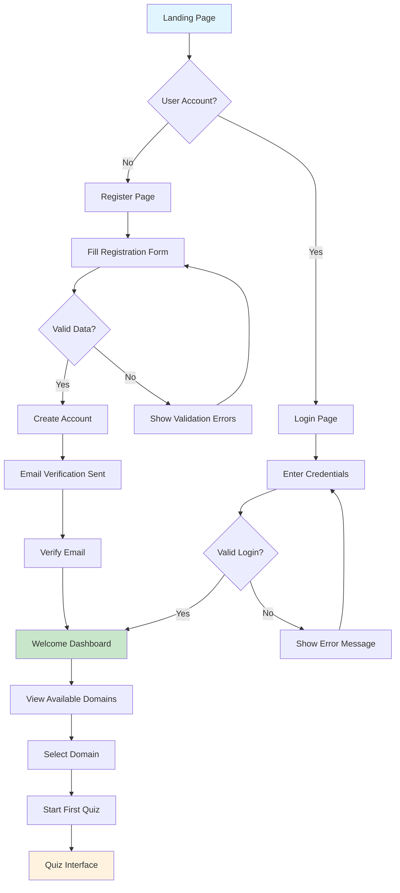
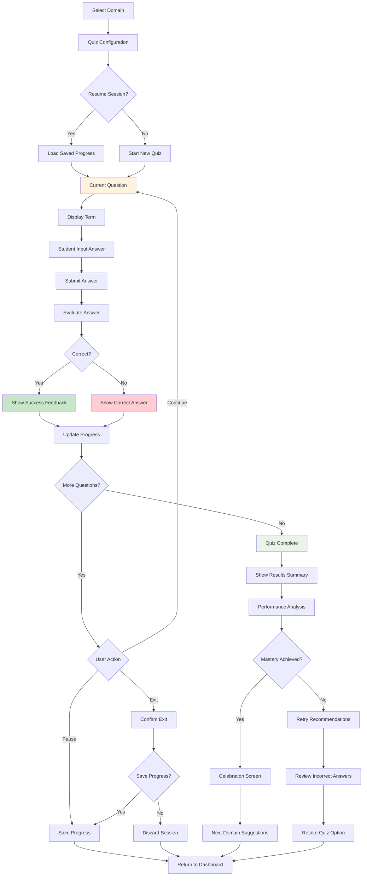
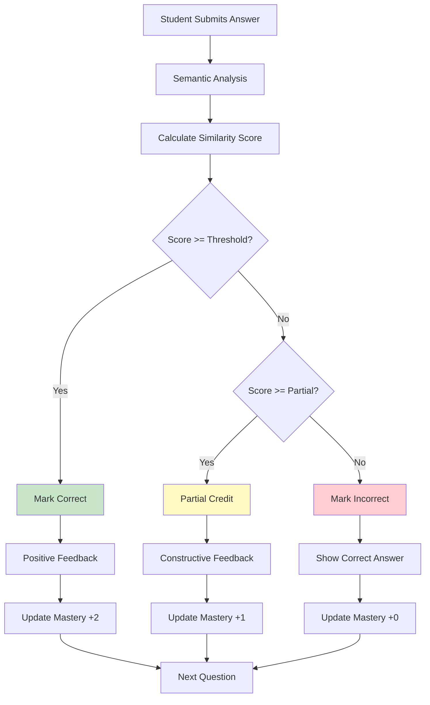
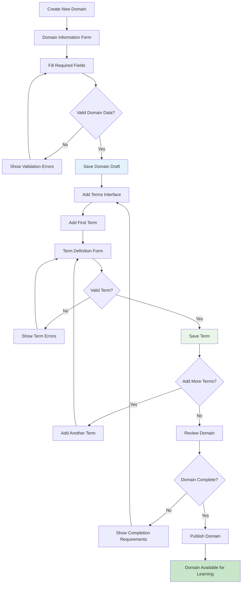
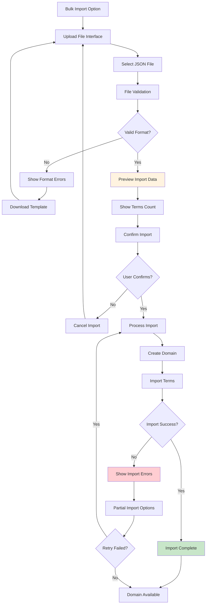
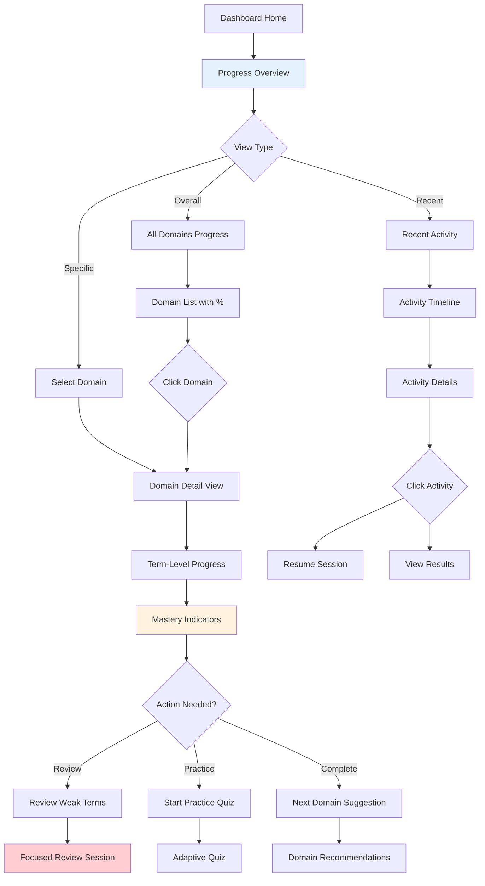
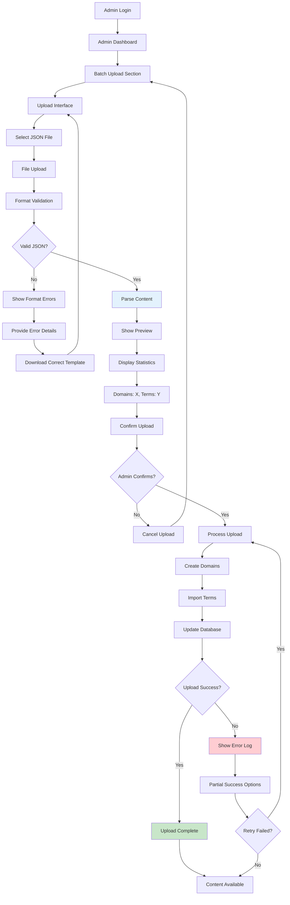
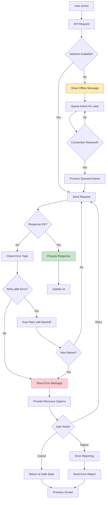
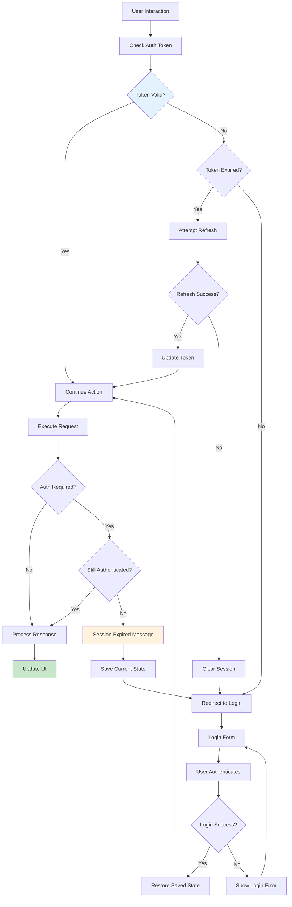

# User Flow Diagrams: Know-It-All Tutor System

## Overview

This document maps the complete user journeys through the Know-It-All Tutor system, focusing on decision points, error states, and "if-this-then-that" scenarios that drive the interface logic.

## Flow 1: New Student Onboarding

### Primary Path: Registration to First Quiz

### Error States & Recovery
- **Invalid Email**: Inline validation with format requirements
- **Weak Password**: Real-time strength indicator with requirements
- **Email Already Exists**: Clear message with login link
- **Verification Timeout**: Resend verification option
- **Network Errors**: Retry mechanism with offline indicator

## Flow 2: Learning Session (Core User Journey)

### Quiz Taking Flow with All States

### Answer Evaluation Logic

## Flow 3: Content Creation Workflow

### Domain Creation Process

### Bulk Import Flow

## Flow 4: Progress Tracking & Analytics

### Progress Dashboard Navigation

## Flow 5: Admin Batch Upload Process

### Administrator Content Management

## Flow 6: Error Handling & Recovery

### Network Error Recovery

## Flow 7: Session Management

### Authentication & Session Handling

## Decision Points & Business Logic

### Quiz Difficulty Adaptation
- **High Performance (>90%)**: Suggest harder domains or advanced terms
- **Medium Performance (70-90%)**: Continue current difficulty level
- **Low Performance (<70%)**: Offer review sessions or easier content

### Progress Calculation Logic
- **Mastery Threshold**: 3 consecutive correct answers or 80% accuracy over 5 attempts
- **Retention Check**: Re-test mastered terms after 7 days
- **Adaptive Spacing**: Increase intervals for consistently correct answers

### Content Validation Rules
- **Domain Requirements**: Minimum 5 terms, maximum 100 terms per domain
- **Term Validation**: Definition must be 10-500 characters
- **Duplicate Detection**: Prevent identical terms within same domain
- **Quality Checks**: Flag domains with low engagement or high error rates

---

*These user flows provide the logical foundation for interface design, ensuring all user paths, error states, and decision points are accounted for in the UI implementation.*